# 카카오톡 테마

직접 만든 카카오톡 테마 모음임. iOS(`.ktheme`)와 안드로이드(`.apk`) 양쪽으로 냄.
남의 테마를 고친 게 아니라 빈 파일에서 시작했음.

색은 팔레트 표 한 곳에서만 관리하고, CSS·`colors.xml`·이미지·미리보기가 전부 거기서 생성됨.

---

## 테마

받는 링크는 항상 **최신 릴리스**를 가리킴. 지난 버전은 [릴리스 목록](https://github.com/Ruminem/kakaotalk-theme/releases)에 있음.
세 번째 그림인 실행화면은 **안드로이드에만 있음** — iOS 테마 규격에는 스플래시 블록이 아예 없음.

<!-- THEMES:START -->

<table>
<tr>
<td width="33%" align="center"><a href="#먹빛-민트"></a></td>
<td width="33%" align="center"><a href="#크림-라떼">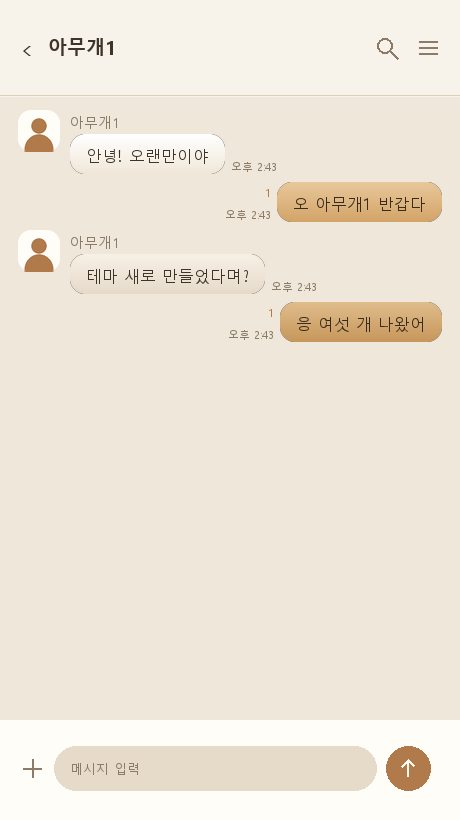</a></td>
<td width="33%" align="center"><a href="#벚꽃-그늘">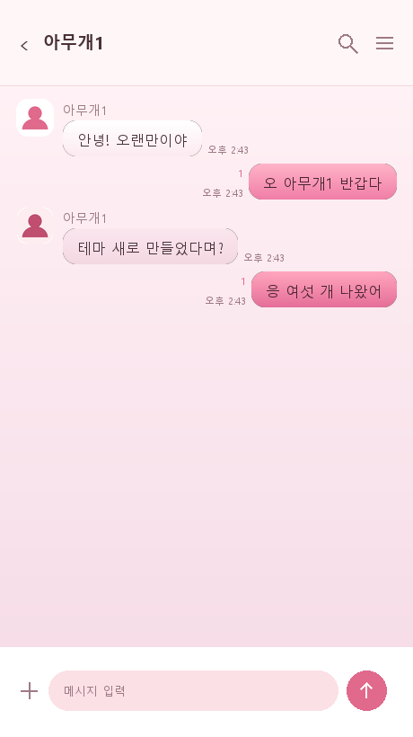</a></td>
</tr>
<tr>
<td align="center">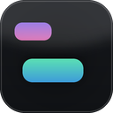 <b><a href="#먹빛-민트">먹빛 민트</a></b><br><sub>기본 · 배경 · 글로우 · 글로우+배경</sub><br>먹색 바탕에 민트 포인트. 말풍선은 민트에서 하늘로, 보라에서 자주로 흐름</td>
<td align="center"> <b><a href="#크림-라떼">크림 라떼</a></b><br><sub>기본 · 배경 · 글로우 · 글로우+배경</sub><br>밝은 쪽. 베이지 바탕에 브라운. 눈이 제일 안 피로한 조합임</td>
<td align="center"> <b><a href="#벚꽃-그늘">벚꽃 그늘</a></b><br><sub>기본 · 벚꽃 배경 · 글로우 · 글로우+배경</sub><br>밝은 분홍. 채팅방 배경 이미지가 깔림</td>
</tr>
<tr>
<td width="33%" align="center"><a href="#믹스드"></a></td>
<td width="33%" align="center"><a href="#오로라">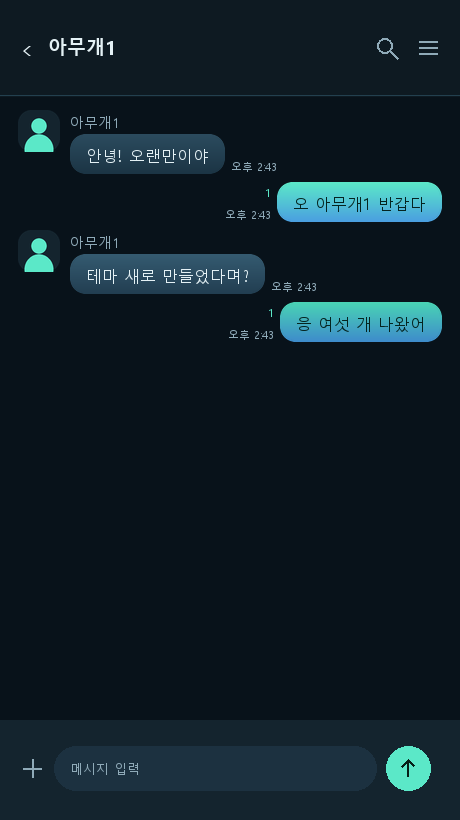</a></td>
<td width="33%" align="center"><a href="#캔디-팝">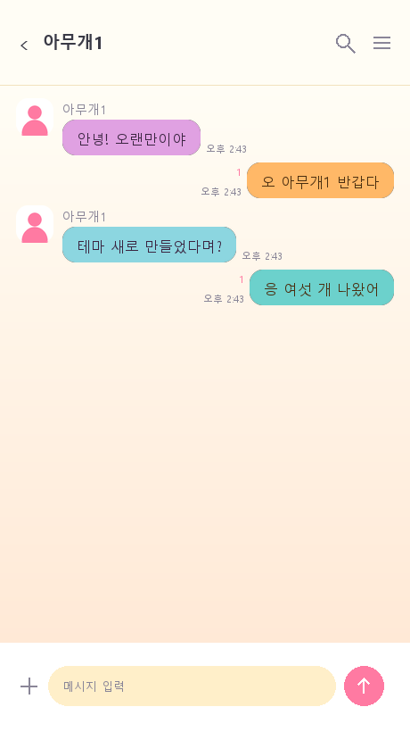</a></td>
</tr>
<tr>
<td align="center">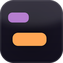 <b><a href="#믹스드">믹스드</a></b><br><sub>기본 · 배경 · 글로우 · 글로우+배경</sub><br>어두운 보라 바탕. 말풍선 네 칸이 전부 다른 색임</td>
<td align="center">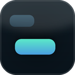 <b><a href="#오로라">오로라</a></b><br><sub>기본 · 배경 · 글로우 · 글로우+배경</sub><br>오로라를 걷어낸 가장 어두운 바탕</td>
<td align="center">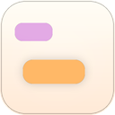 <b><a href="#캔디-팝">캔디 팝</a></b><br><sub>기본 · 사탕 배경 · 글로우 · 글로우+배경</sub><br>밝은 쪽 알록달록. 말풍선 네 칸이 전부 다르고 배경도 있음</td>
</tr>
<tr>
<td width="33%" align="center"><a href="#리퀴드-글래스">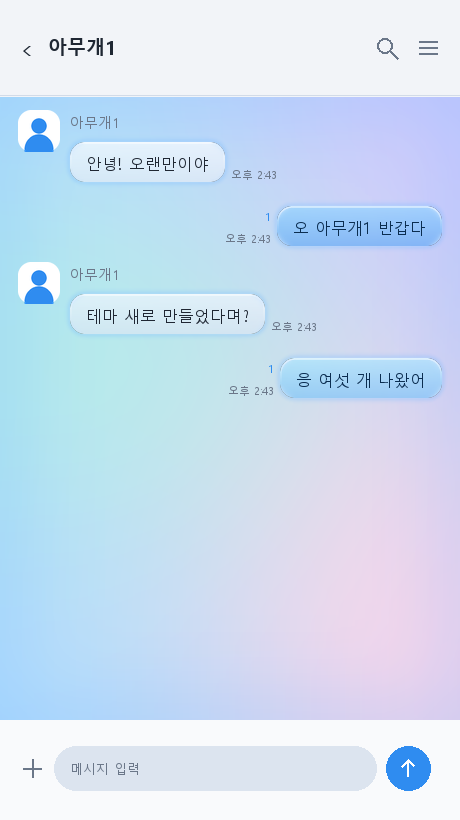</a></td>
<td width="33%" align="center"><a href="#심야"></a></td>
<td width="33%" align="center"><a href="#바다">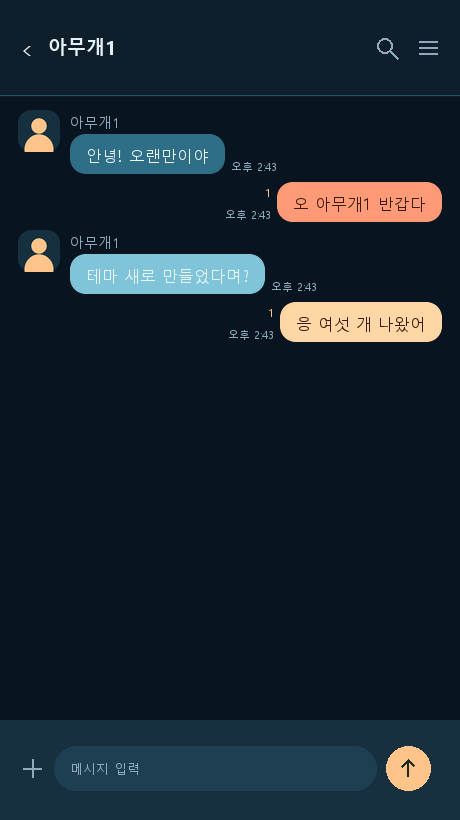</a></td>
</tr>
<tr>
<td align="center">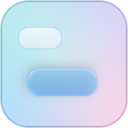 <b><a href="#리퀴드-글래스">리퀴드 글래스</a></b><br><sub>라이트 · 다크</sub><br>유리 너머로 빛이 번지는 밝은 쪽. 말풍선과 목록이 반투명이라 배경이 비침</td>
<td align="center">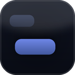 <b><a href="#심야">심야</a></b><br><sub>기본 · 배경 · 글로우 · 글로우+배경</sub><br>밤하늘을 걷어낸 남색 바탕</td>
<td align="center">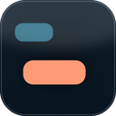 <b><a href="#바다">바다</a></b><br><sub>기본 · 배경 · 글로우 · 글로우+배경</sub><br>바다를 걷어낸 짙은 물빛 바탕</td>
</tr>
<tr>
<td width="33%" align="center"><a href="#숲">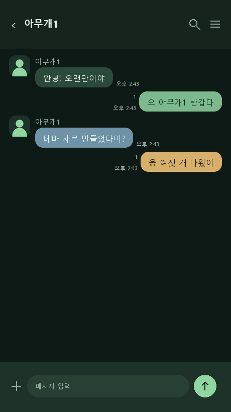</a></td>
<td width="33%" align="center"><a href="#설원">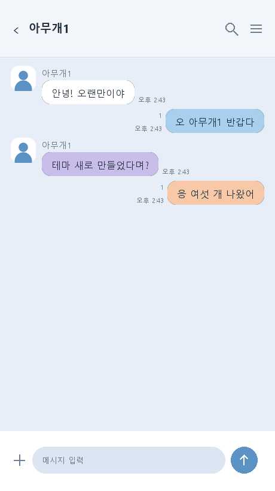</a></td>
<td width="33%" align="center"><a href="#도형">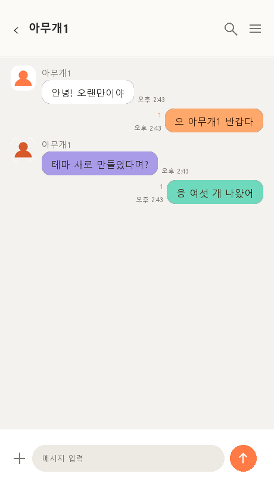</a></td>
</tr>
<tr>
<td align="center">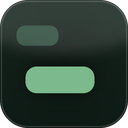 <b><a href="#숲">숲</a></b><br><sub>기본 · 배경 · 글로우 · 글로우+배경</sub><br>숲을 걷어낸 이끼빛 바탕</td>
<td align="center"> <b><a href="#설원">설원</a></b><br><sub>기본 · 배경 · 글로우 · 글로우+배경</sub><br>눈을 걷어낸 얼음빛 바탕</td>
<td align="center"> <b><a href="#도형">도형</a></b><br><sub>기본 · 배경 · 글로우 · 글로우+배경</sub><br>도형을 걷어낸 미색 바탕</td>
</tr>
<tr>
<td width="33%" align="center"><a href="#야경">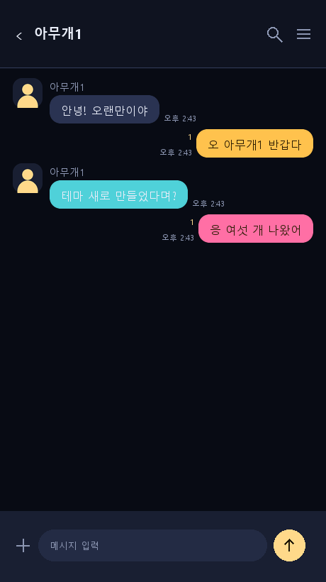</a></td>
</tr>
<tr>
<td align="center"> <b><a href="#야경">야경</a></b><br><sub>기본 · 배경 · 글로우 · 글로우+배경</sub><br>담백한 남색 바탕. 네온 네 색 말풍선</td>
</tr>
</table>

<a name="먹빛-민트"></a>

###  먹빛 민트

<table>
<tr>
<td width="50%" align="center"><br><b>기본</b><br><sub>먹색 바탕에 민트 포인트. 말풍선은 민트에서 하늘로, 보라에서 자주로 흐름</sub><br><a href="https://github.com/Ruminem/kakaotalk-theme/releases/latest/download/inkmint-basic.ktheme">iOS</a> · <a href="https://github.com/Ruminem/kakaotalk-theme/releases/latest/download/inkmint-basic.apk">Android</a></td>
<td width="50%" align="center">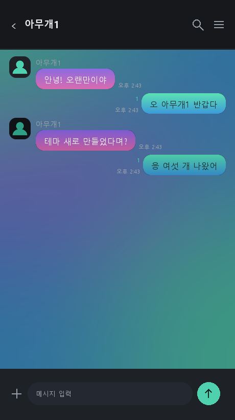<br><b>배경</b><br><sub>먹빛 위에 민트 빛 덩어리가 번짐</sub><br><a href="https://github.com/Ruminem/kakaotalk-theme/releases/latest/download/inkmint-image.ktheme">iOS</a> · <a href="https://github.com/Ruminem/kakaotalk-theme/releases/latest/download/inkmint-image.apk">Android</a></td>
</tr>
<tr>
<td width="50%" align="center">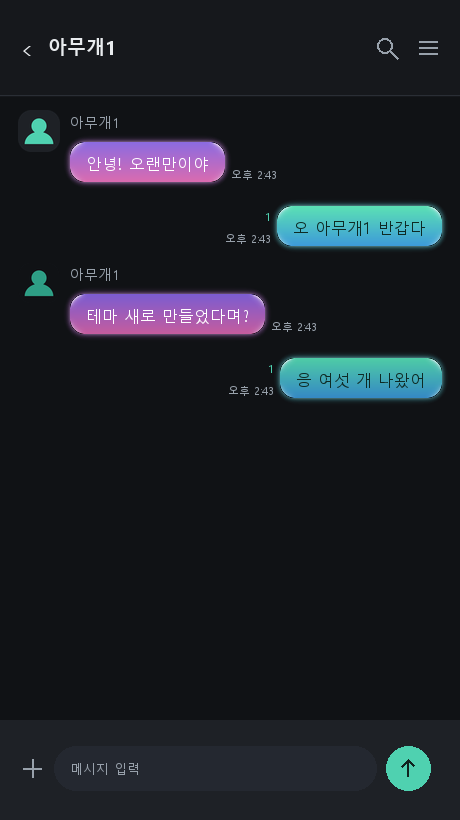<br><b>글로우</b><br><sub>말풍선이 민트와 보라로 빛남</sub><br><a href="https://github.com/Ruminem/kakaotalk-theme/releases/latest/download/inkmint-glow.ktheme">iOS</a> · <a href="https://github.com/Ruminem/kakaotalk-theme/releases/latest/download/inkmint-glow.apk">Android</a></td>
<td width="50%" align="center">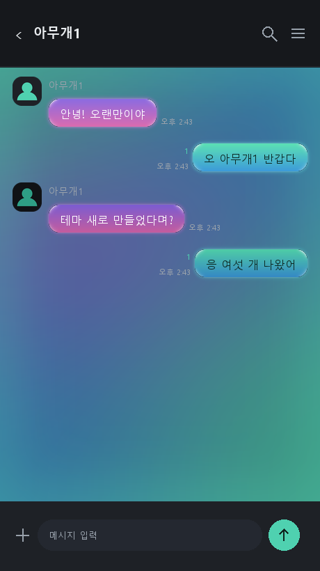<br><b>글로우+배경</b><br><sub>배경과 글로우를 함께</sub><br><a href="https://github.com/Ruminem/kakaotalk-theme/releases/latest/download/inkmint-glow-image.ktheme">iOS</a> · <a href="https://github.com/Ruminem/kakaotalk-theme/releases/latest/download/inkmint-glow-image.apk">Android</a></td>
</tr>
</table>

<details><summary>화면 더 보기 (목록 · 잠금화면 · 실행화면)</summary>

**기본** — 먹색 바탕에 민트 포인트. 말풍선은 민트에서 하늘로, 보라에서 자주로 흐름

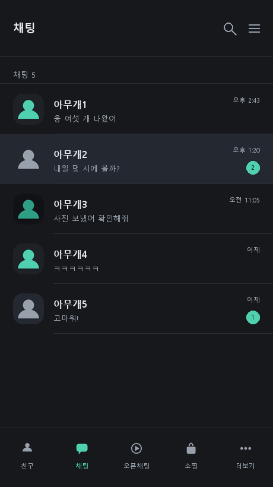  

**배경** — 먹빛 위에 민트 빛 덩어리가 번짐

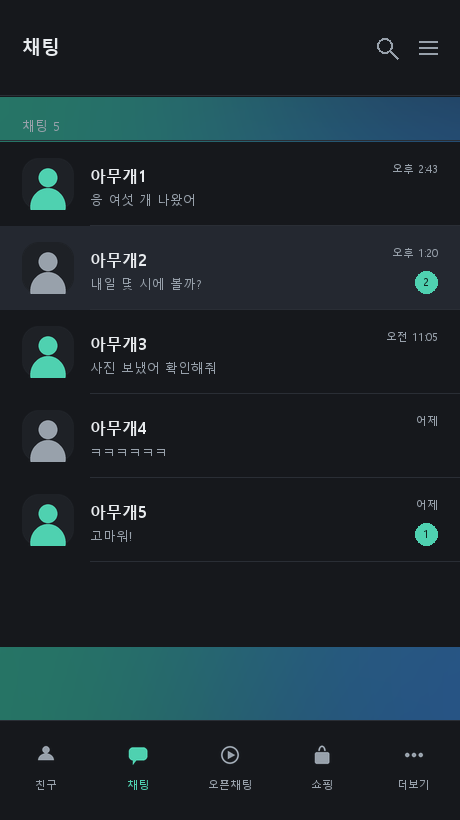 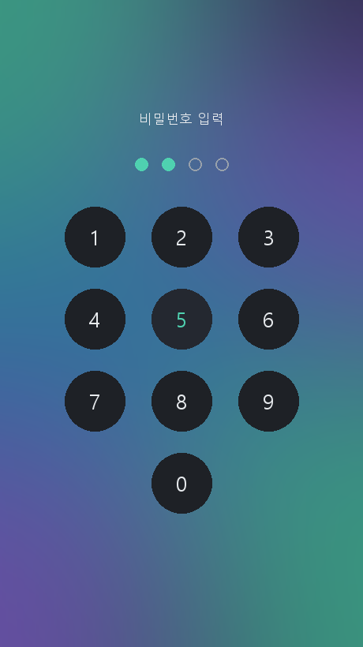 

**글로우** — 말풍선이 민트와 보라로 빛남

  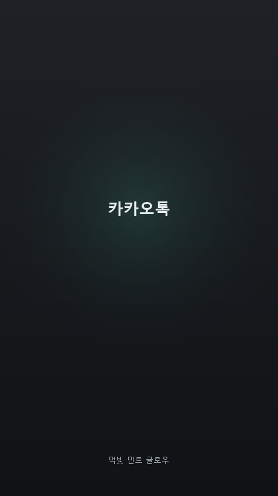

**글로우+배경** — 배경과 글로우를 함께

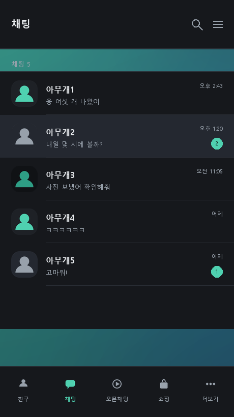 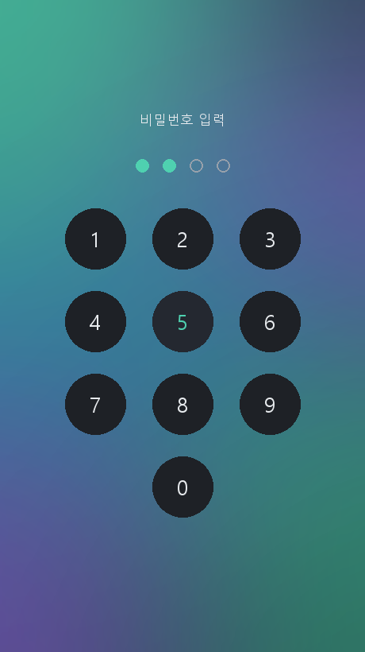 

</details>

<a name="크림-라떼"></a>

###  크림 라떼

<table>
<tr>
<td width="50%" align="center"><br><b>기본</b><br><sub>밝은 쪽. 베이지 바탕에 브라운. 눈이 제일 안 피로한 조합임</sub><br><a href="https://github.com/Ruminem/kakaotalk-theme/releases/latest/download/cream-basic.ktheme">iOS</a> · <a href="https://github.com/Ruminem/kakaotalk-theme/releases/latest/download/cream-basic.apk">Android</a></td>
<td width="50%" align="center">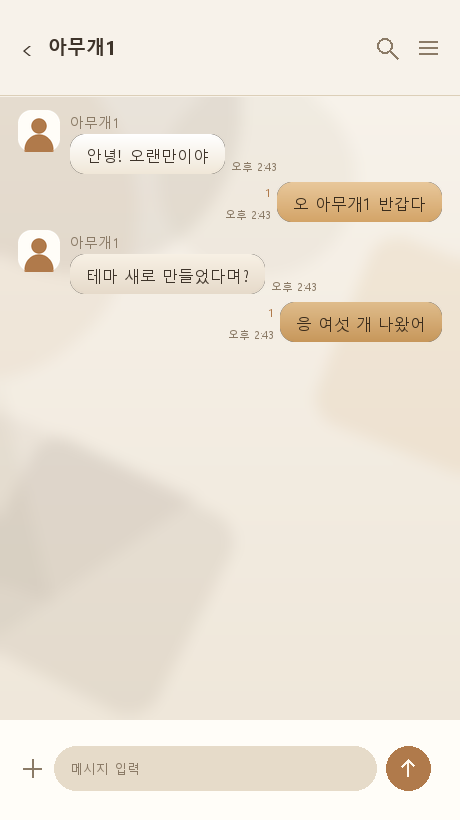<br><b>배경</b><br><sub>크림빛 바탕에 둥근 도형이 겹침</sub><br><a href="https://github.com/Ruminem/kakaotalk-theme/releases/latest/download/cream-image.ktheme">iOS</a> · <a href="https://github.com/Ruminem/kakaotalk-theme/releases/latest/download/cream-image.apk">Android</a></td>
</tr>
<tr>
<td width="50%" align="center">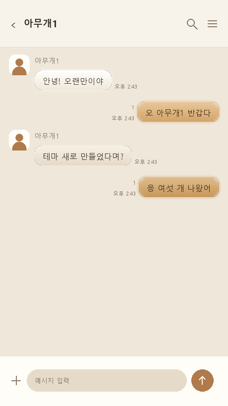<br><b>글로우</b><br><sub>브라운 말풍선이 은은하게 빛남</sub><br><a href="https://github.com/Ruminem/kakaotalk-theme/releases/latest/download/cream-glow.ktheme">iOS</a> · <a href="https://github.com/Ruminem/kakaotalk-theme/releases/latest/download/cream-glow.apk">Android</a></td>
<td width="50%" align="center">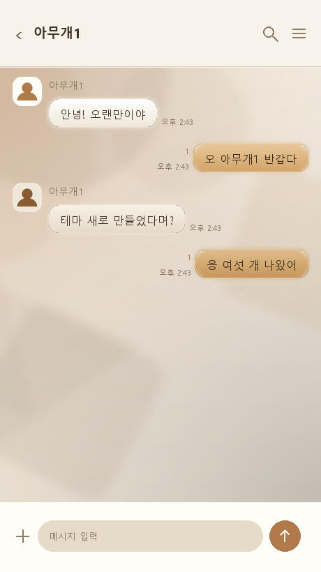<br><b>글로우+배경</b><br><sub>도형 배경에 빛나는 말풍선</sub><br><a href="https://github.com/Ruminem/kakaotalk-theme/releases/latest/download/cream-glow-image.ktheme">iOS</a> · <a href="https://github.com/Ruminem/kakaotalk-theme/releases/latest/download/cream-glow-image.apk">Android</a></td>
</tr>
</table>

<details><summary>화면 더 보기 (목록 · 잠금화면 · 실행화면)</summary>

**기본** — 밝은 쪽. 베이지 바탕에 브라운. 눈이 제일 안 피로한 조합임

  

**배경** — 크림빛 바탕에 둥근 도형이 겹침

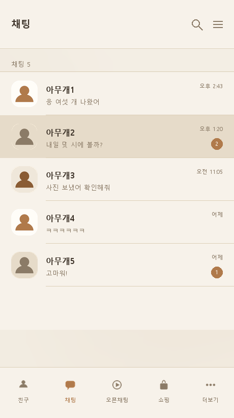 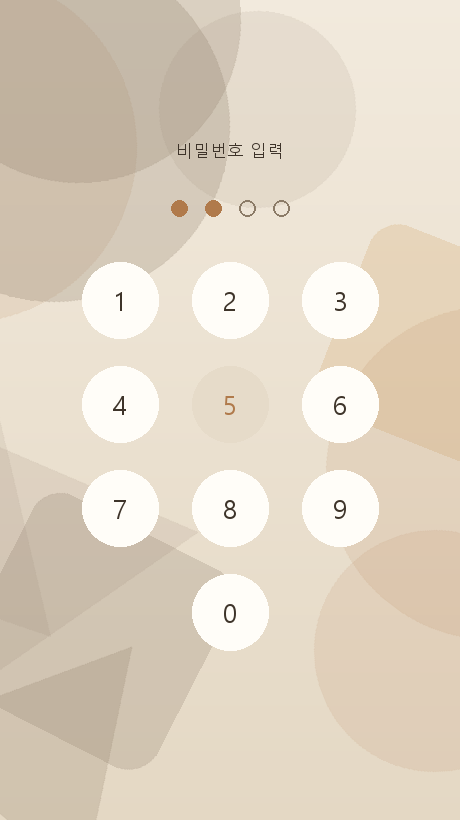 

**글로우** — 브라운 말풍선이 은은하게 빛남

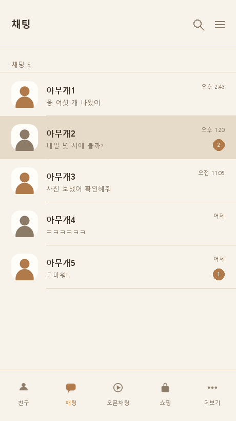 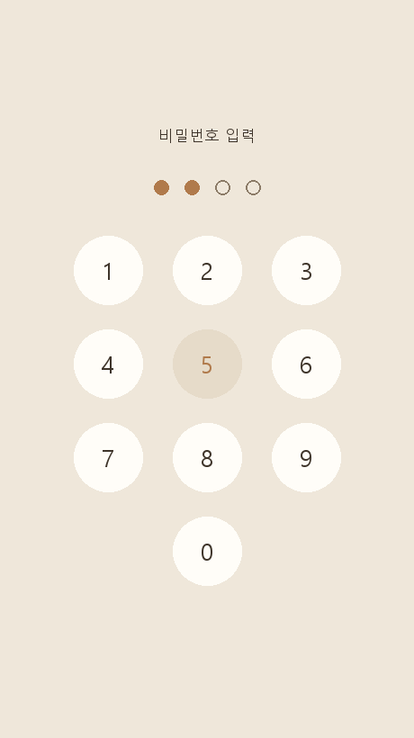 

**글로우+배경** — 도형 배경에 빛나는 말풍선

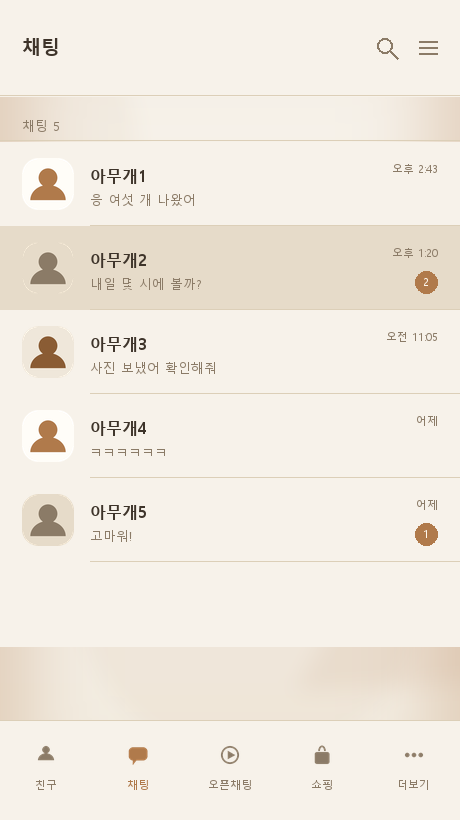 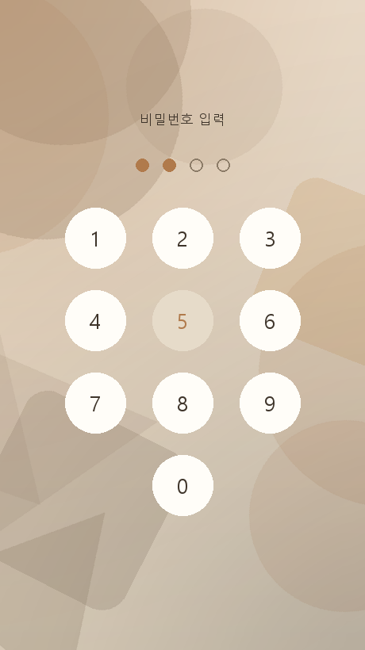 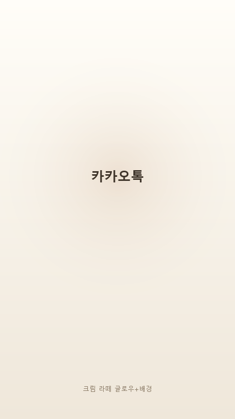

</details>

<a name="벚꽃-그늘"></a>

###  벚꽃 그늘

<table>
<tr>
<td width="50%" align="center"><br><b>기본</b><br><sub>밝은 분홍. 채팅방 배경 이미지가 깔림</sub><br><a href="https://github.com/Ruminem/kakaotalk-theme/releases/latest/download/sakura-basic.ktheme">iOS</a> · <a href="https://github.com/Ruminem/kakaotalk-theme/releases/latest/download/sakura-basic.apk">Android</a></td>
<td width="50%" align="center">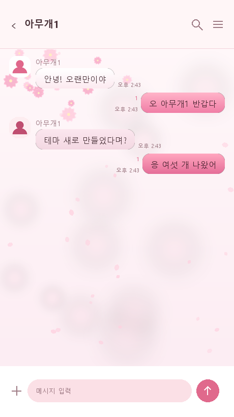<br><b>벚꽃 배경</b><br><sub>벚꽃 그늘에 가지와 꽃잎을 그려 넣었음</sub><br><a href="https://github.com/Ruminem/kakaotalk-theme/releases/latest/download/sakura-image.ktheme">iOS</a> · <a href="https://github.com/Ruminem/kakaotalk-theme/releases/latest/download/sakura-image.apk">Android</a></td>
</tr>
<tr>
<td width="50%" align="center">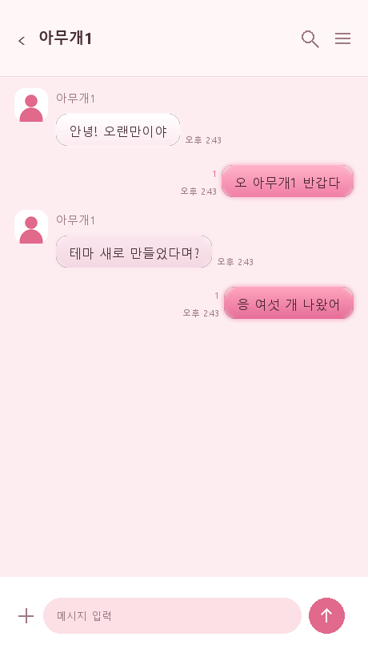<br><b>글로우</b><br><sub>분홍 말풍선이 빛남</sub><br><a href="https://github.com/Ruminem/kakaotalk-theme/releases/latest/download/sakura-glow.ktheme">iOS</a> · <a href="https://github.com/Ruminem/kakaotalk-theme/releases/latest/download/sakura-glow.apk">Android</a></td>
<td width="50%" align="center">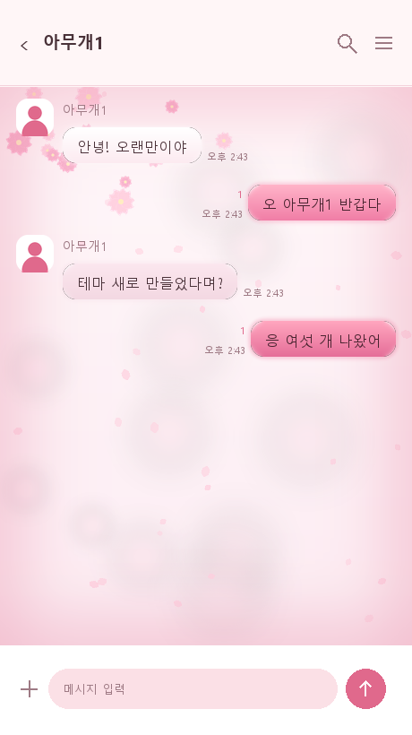<br><b>글로우+배경</b><br><sub>벚꽃 배경에 빛나는 말풍선</sub><br><a href="https://github.com/Ruminem/kakaotalk-theme/releases/latest/download/sakura-glow-image.ktheme">iOS</a> · <a href="https://github.com/Ruminem/kakaotalk-theme/releases/latest/download/sakura-glow-image.apk">Android</a></td>
</tr>
</table>

<details><summary>화면 더 보기 (목록 · 잠금화면 · 실행화면)</summary>

**기본** — 밝은 분홍. 채팅방 배경 이미지가 깔림

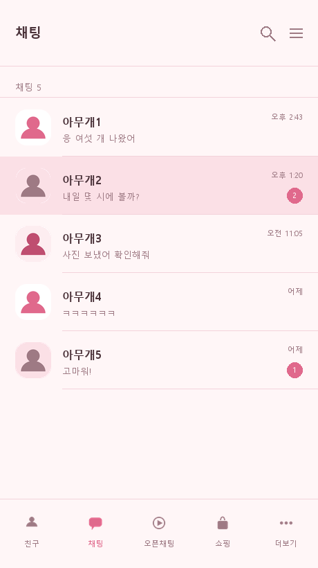  

**벚꽃 배경** — 벚꽃 그늘에 가지와 꽃잎을 그려 넣었음

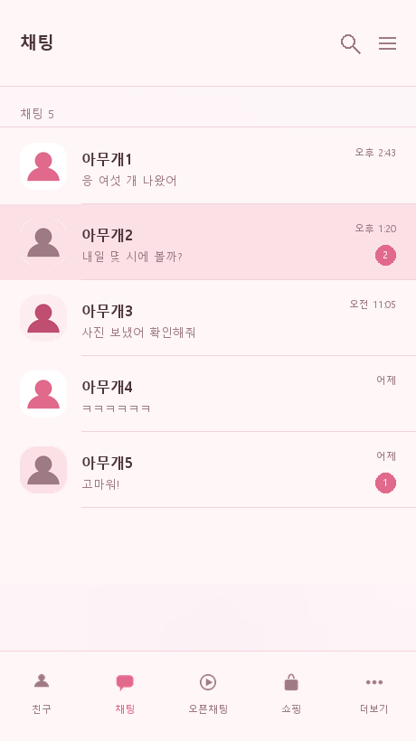 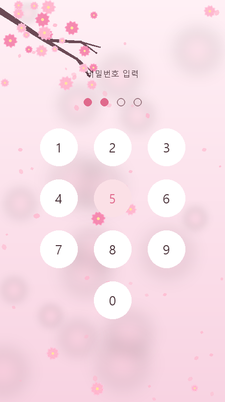 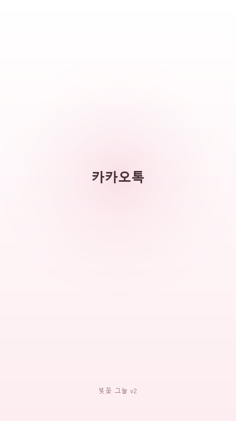

**글로우** — 분홍 말풍선이 빛남

  

**글로우+배경** — 벚꽃 배경에 빛나는 말풍선

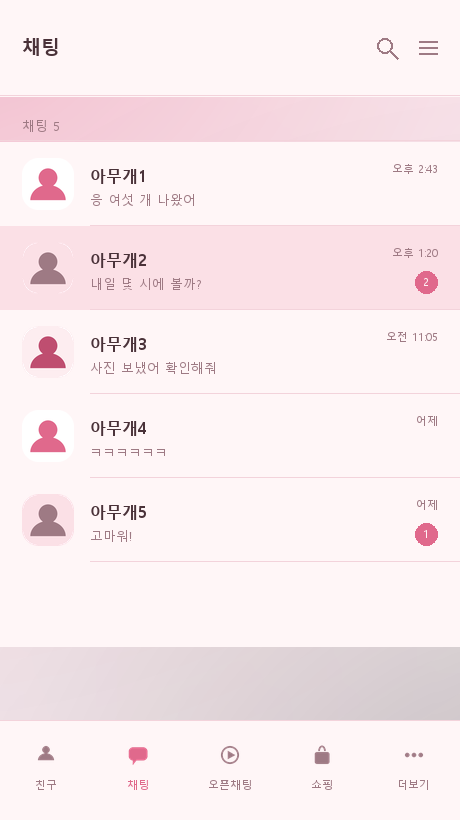 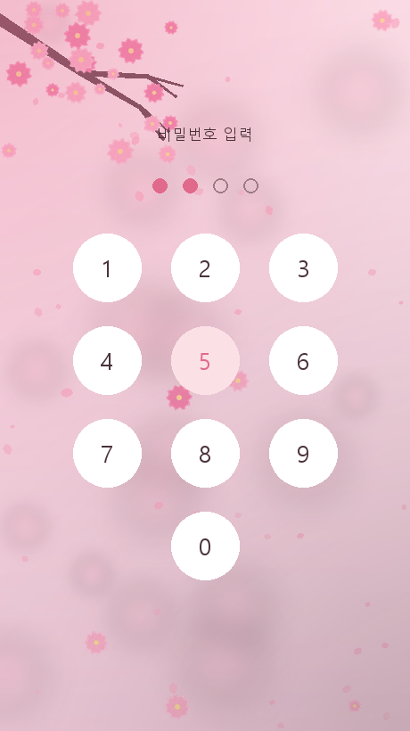 

</details>

<a name="믹스드"></a>

###  믹스드

<table>
<tr>
<td width="50%" align="center"><br><b>기본</b><br><sub>어두운 보라 바탕. 말풍선 네 칸이 전부 다른 색임</sub><br><a href="https://github.com/Ruminem/kakaotalk-theme/releases/latest/download/mixed-basic.ktheme">iOS</a> · <a href="https://github.com/Ruminem/kakaotalk-theme/releases/latest/download/mixed-basic.apk">Android</a></td>
<td width="50%" align="center">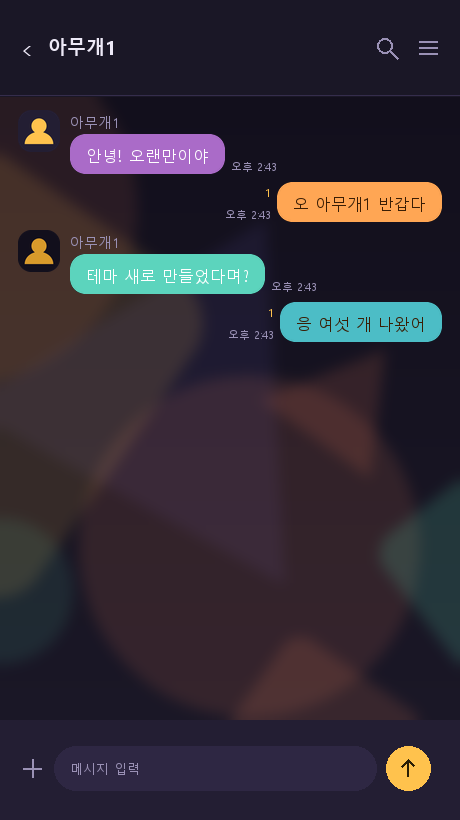<br><b>배경</b><br><sub>어두운 보라 위에 큰 도형이 겹침</sub><br><a href="https://github.com/Ruminem/kakaotalk-theme/releases/latest/download/mixed-image.ktheme">iOS</a> · <a href="https://github.com/Ruminem/kakaotalk-theme/releases/latest/download/mixed-image.apk">Android</a></td>
</tr>
<tr>
<td width="50%" align="center"><br><b>글로우</b><br><sub>믹스드에 글로우를 얹은 것. 말풍선마다 자기 색으로 빛남</sub><br><a href="https://github.com/Ruminem/kakaotalk-theme/releases/latest/download/mixed-glow.ktheme">iOS</a> · <a href="https://github.com/Ruminem/kakaotalk-theme/releases/latest/download/mixed-glow.apk">Android</a></td>
<td width="50%" align="center">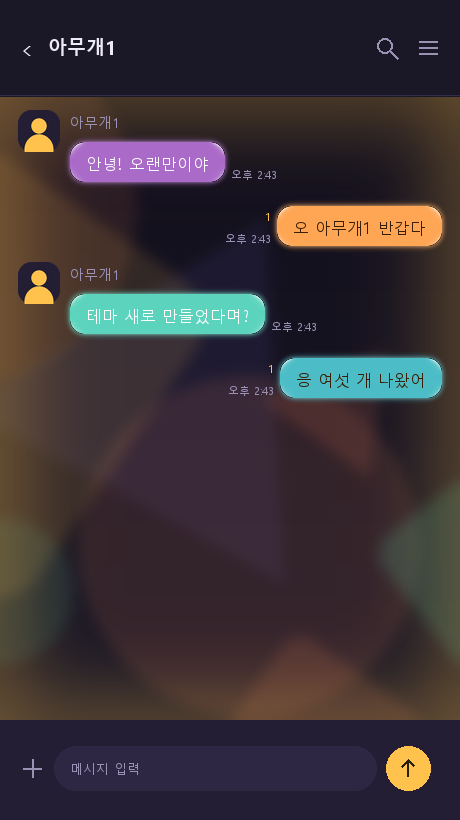<br><b>글로우+배경</b><br><sub>도형 배경에 네 색 말풍선이 빛남</sub><br><a href="https://github.com/Ruminem/kakaotalk-theme/releases/latest/download/mixed-glow-image.ktheme">iOS</a> · <a href="https://github.com/Ruminem/kakaotalk-theme/releases/latest/download/mixed-glow-image.apk">Android</a></td>
</tr>
</table>

<details><summary>화면 더 보기 (목록 · 잠금화면 · 실행화면)</summary>

**기본** — 어두운 보라 바탕. 말풍선 네 칸이 전부 다른 색임

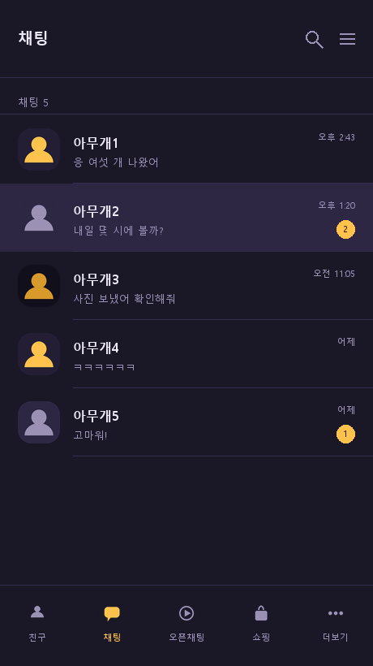 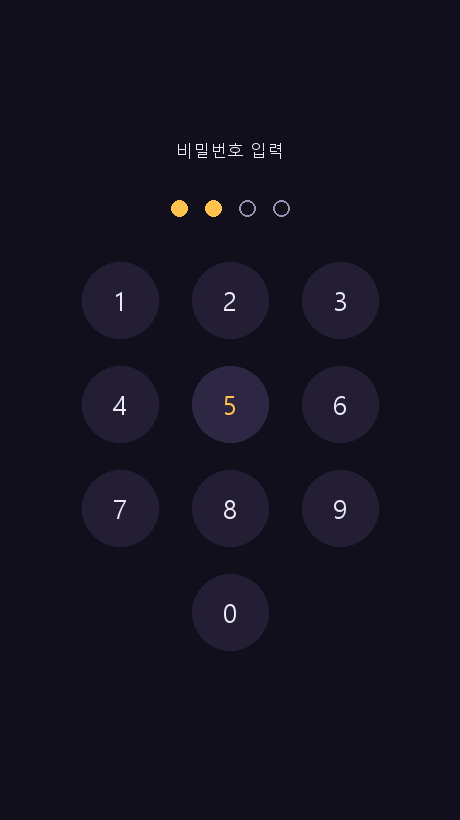 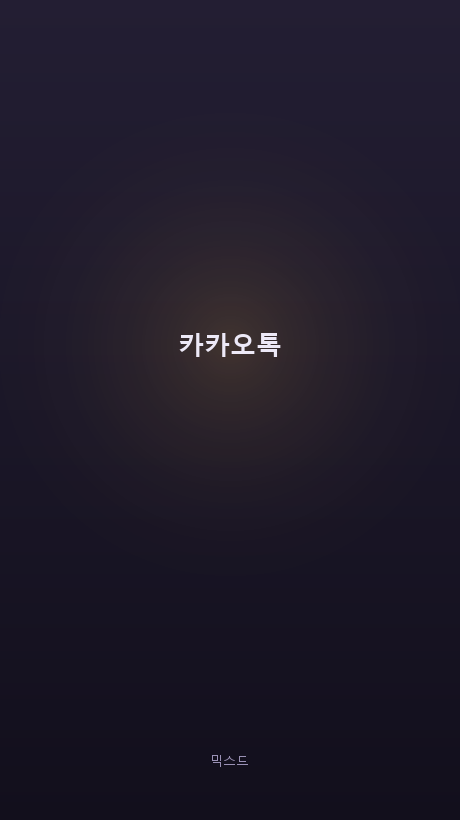

**배경** — 어두운 보라 위에 큰 도형이 겹침

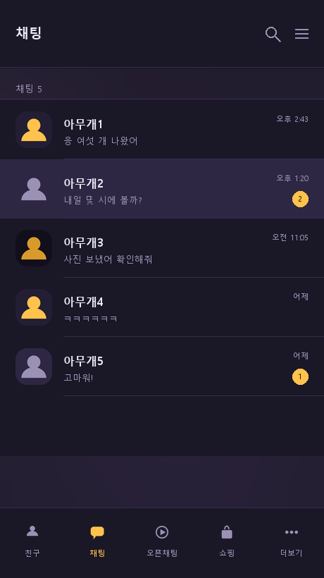 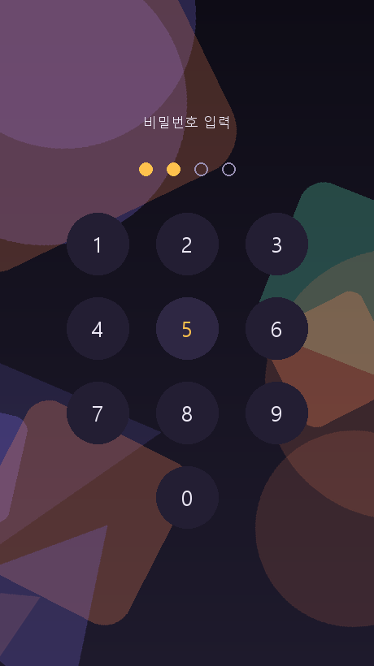 

**글로우** — 믹스드에 글로우를 얹은 것. 말풍선마다 자기 색으로 빛남

  

**글로우+배경** — 도형 배경에 네 색 말풍선이 빛남

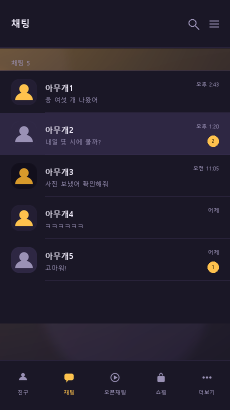 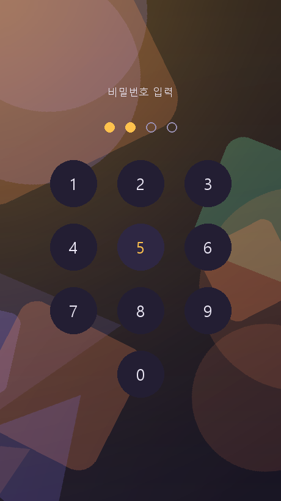 

</details>

<a name="오로라"></a>

###  오로라

<table>
<tr>
<td width="50%" align="center"><br><b>기본</b><br><sub>오로라를 걷어낸 가장 어두운 바탕</sub><br><a href="https://github.com/Ruminem/kakaotalk-theme/releases/latest/download/aurora-basic.ktheme">iOS</a> · <a href="https://github.com/Ruminem/kakaotalk-theme/releases/latest/download/aurora-basic.apk">Android</a></td>
<td width="50%" align="center">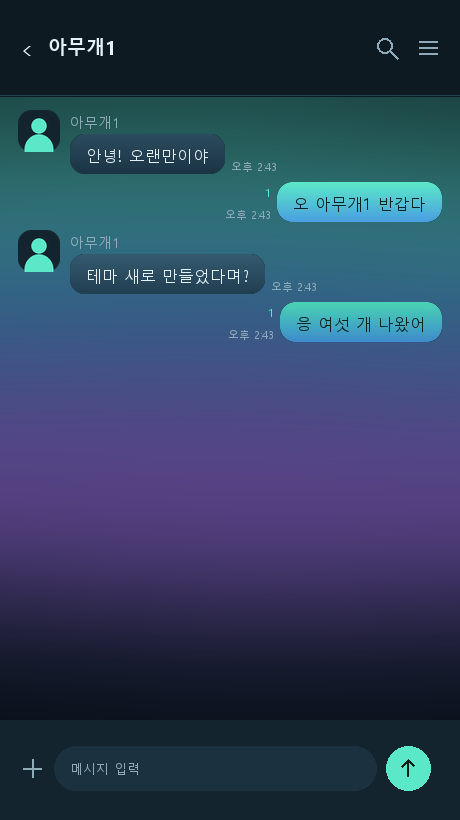<br><b>배경</b><br><sub>가장 어두운 테마. 채팅방 배경에 오로라가 번짐</sub><br><a href="https://github.com/Ruminem/kakaotalk-theme/releases/latest/download/aurora-image.ktheme">iOS</a> · <a href="https://github.com/Ruminem/kakaotalk-theme/releases/latest/download/aurora-image.apk">Android</a></td>
</tr>
<tr>
<td width="50%" align="center">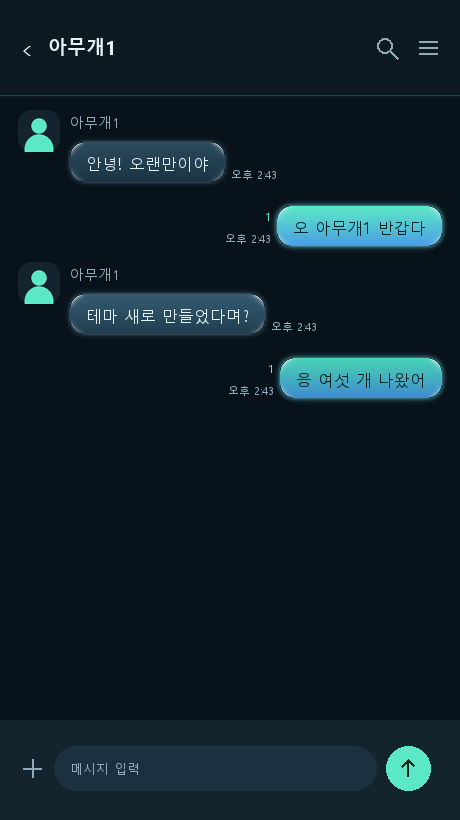<br><b>글로우</b><br><sub>말풍선이 오로라 색으로 빛남</sub><br><a href="https://github.com/Ruminem/kakaotalk-theme/releases/latest/download/aurora-glow.ktheme">iOS</a> · <a href="https://github.com/Ruminem/kakaotalk-theme/releases/latest/download/aurora-glow.apk">Android</a></td>
<td width="50%" align="center"><br><b>글로우+배경</b><br><sub>오로라 배경에 빛나는 말풍선</sub><br><a href="https://github.com/Ruminem/kakaotalk-theme/releases/latest/download/aurora-glow-image.ktheme">iOS</a> · <a href="https://github.com/Ruminem/kakaotalk-theme/releases/latest/download/aurora-glow-image.apk">Android</a></td>
</tr>
</table>

<details><summary>화면 더 보기 (목록 · 잠금화면 · 실행화면)</summary>

**기본** — 오로라를 걷어낸 가장 어두운 바탕

 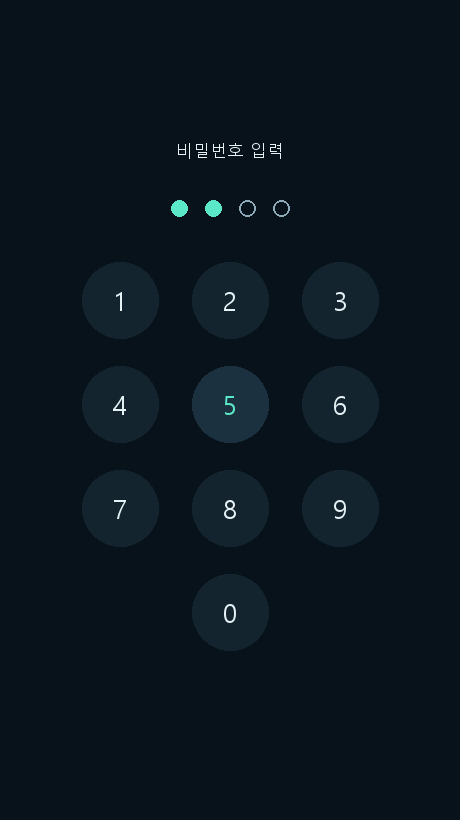 

**배경** — 가장 어두운 테마. 채팅방 배경에 오로라가 번짐

  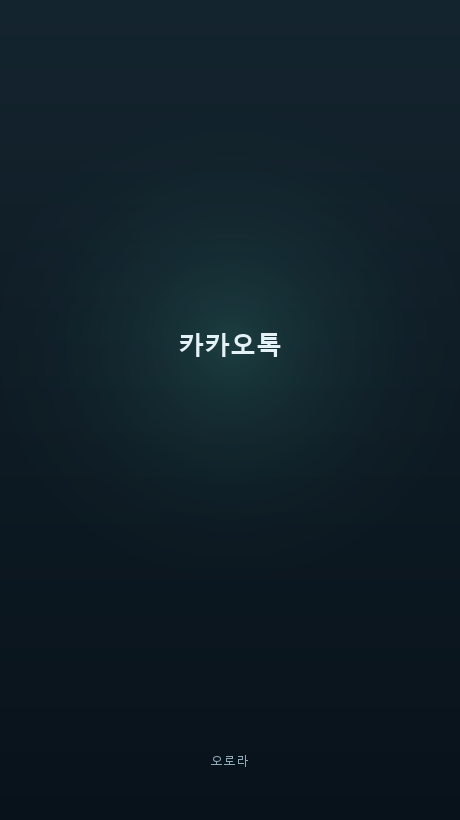

**글로우** — 말풍선이 오로라 색으로 빛남

  

**글로우+배경** — 오로라 배경에 빛나는 말풍선

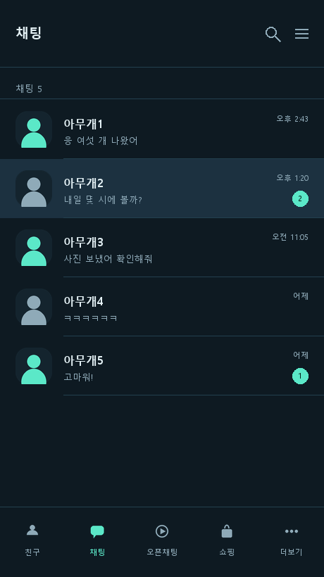  

</details>

<a name="캔디-팝"></a>

###  캔디 팝

<table>
<tr>
<td width="50%" align="center"><br><b>기본</b><br><sub>밝은 쪽 알록달록. 말풍선 네 칸이 전부 다르고 배경도 있음</sub><br><a href="https://github.com/Ruminem/kakaotalk-theme/releases/latest/download/candy-basic.ktheme">iOS</a> · <a href="https://github.com/Ruminem/kakaotalk-theme/releases/latest/download/candy-basic.apk">Android</a></td>
<td width="50%" align="center">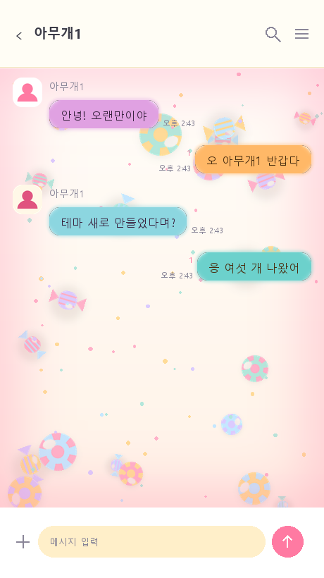<br><b>사탕 배경</b><br><sub>캔디 팝 v2 에 사탕을 흩뿌린 배경을 깔았음</sub><br><a href="https://github.com/Ruminem/kakaotalk-theme/releases/latest/download/candy-image.ktheme">iOS</a> · <a href="https://github.com/Ruminem/kakaotalk-theme/releases/latest/download/candy-image.apk">Android</a></td>
</tr>
<tr>
<td width="50%" align="center">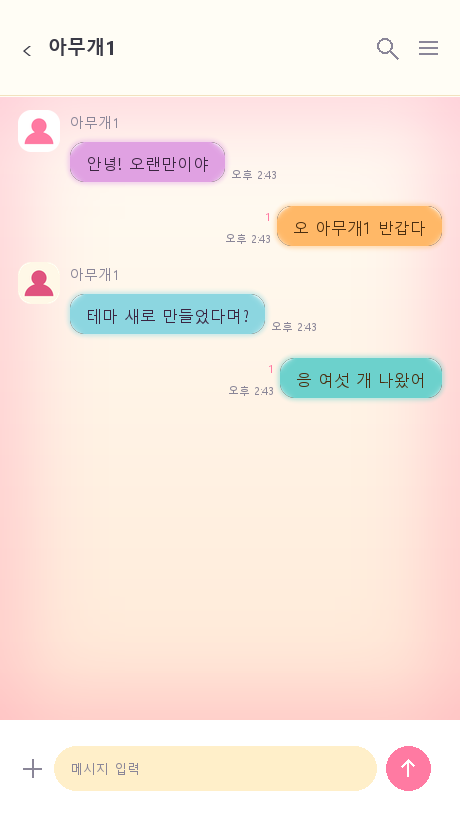<br><b>글로우</b><br><sub>캔디 팝에 글로우를 얹은 것. 밝은 바탕이라 빛이 은은하게 걸림</sub><br><a href="https://github.com/Ruminem/kakaotalk-theme/releases/latest/download/candy-glow.ktheme">iOS</a> · <a href="https://github.com/Ruminem/kakaotalk-theme/releases/latest/download/candy-glow.apk">Android</a></td>
<td width="50%" align="center">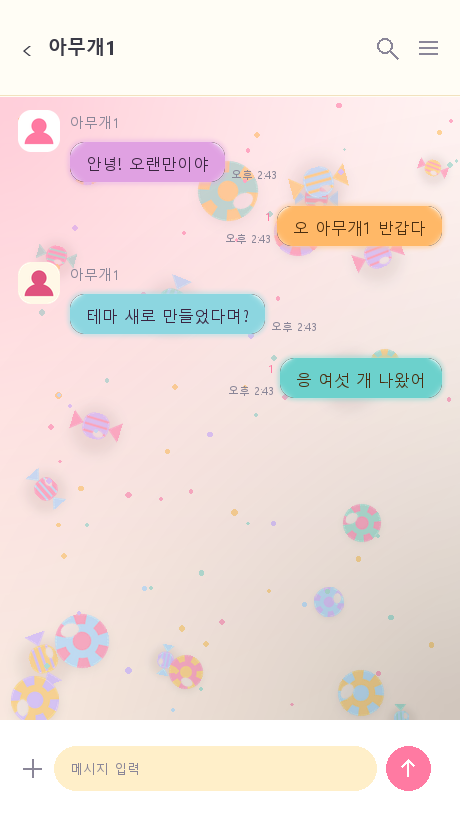<br><b>글로우+배경</b><br><sub>사탕 배경에 빛나는 말풍선</sub><br><a href="https://github.com/Ruminem/kakaotalk-theme/releases/latest/download/candy-glow-image.ktheme">iOS</a> · <a href="https://github.com/Ruminem/kakaotalk-theme/releases/latest/download/candy-glow-image.apk">Android</a></td>
</tr>
</table>

<details><summary>화면 더 보기 (목록 · 잠금화면 · 실행화면)</summary>

**기본** — 밝은 쪽 알록달록. 말풍선 네 칸이 전부 다르고 배경도 있음

  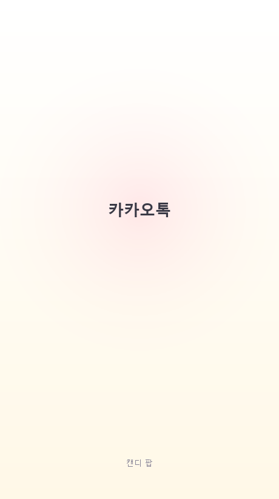

**사탕 배경** — 캔디 팝 v2 에 사탕을 흩뿌린 배경을 깔았음

 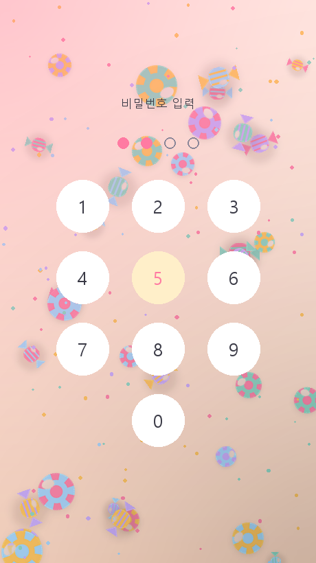 

**글로우** — 캔디 팝에 글로우를 얹은 것. 밝은 바탕이라 빛이 은은하게 걸림

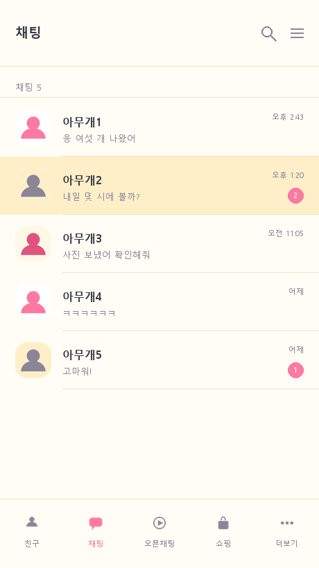 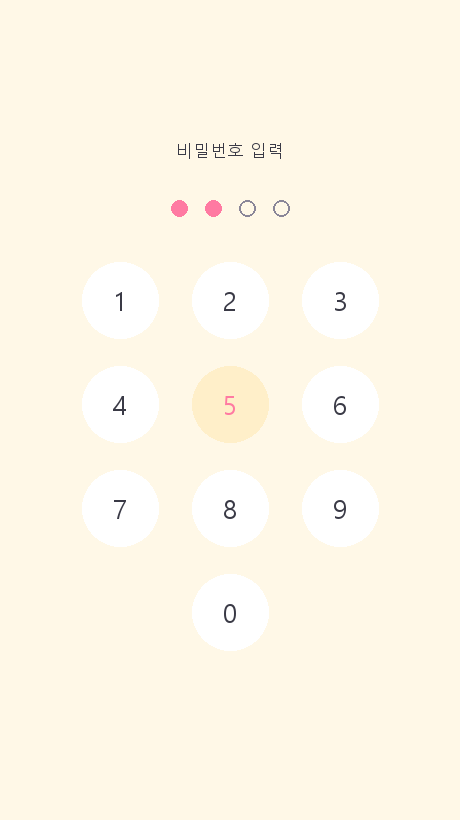 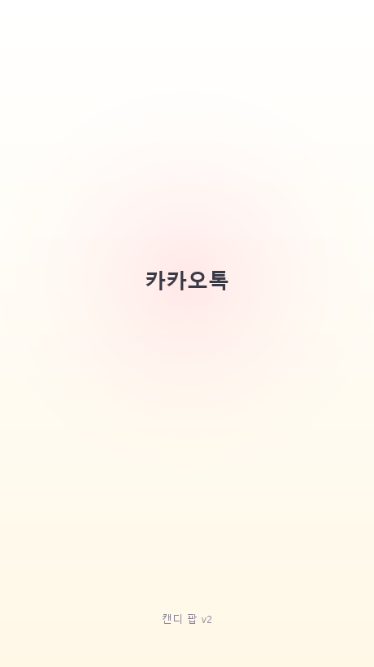

**글로우+배경** — 사탕 배경에 빛나는 말풍선

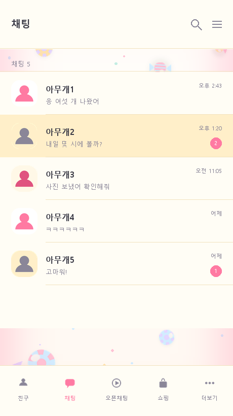 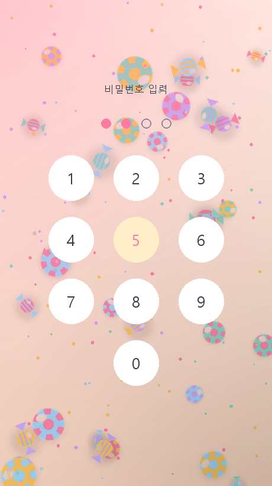 

</details>

<a name="리퀴드-글래스"></a>

###  리퀴드 글래스

<table>
<tr>
<td width="50%" align="center"><br><b>라이트</b><br><sub>유리 너머로 빛이 번지는 밝은 쪽. 말풍선과 목록이 반투명이라 배경이 비침</sub><br><a href="https://github.com/Ruminem/kakaotalk-theme/releases/latest/download/glass-light.ktheme">iOS</a> · <a href="https://github.com/Ruminem/kakaotalk-theme/releases/latest/download/glass-light.apk">Android</a></td>
<td width="50%" align="center">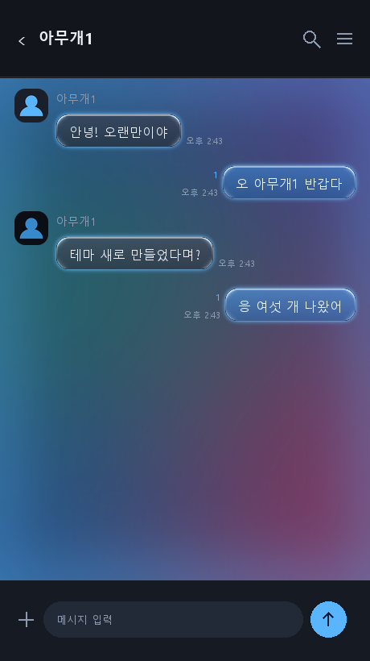<br><b>다크</b><br><sub>같은 유리를 어두운 쪽으로. 빛이 유리 모서리에만 걸림</sub><br><a href="https://github.com/Ruminem/kakaotalk-theme/releases/latest/download/glass-dark.ktheme">iOS</a> · <a href="https://github.com/Ruminem/kakaotalk-theme/releases/latest/download/glass-dark.apk">Android</a></td>
</tr>
</table>

<details><summary>화면 더 보기 (목록 · 잠금화면 · 실행화면)</summary>

**라이트** — 유리 너머로 빛이 번지는 밝은 쪽. 말풍선과 목록이 반투명이라 배경이 비침

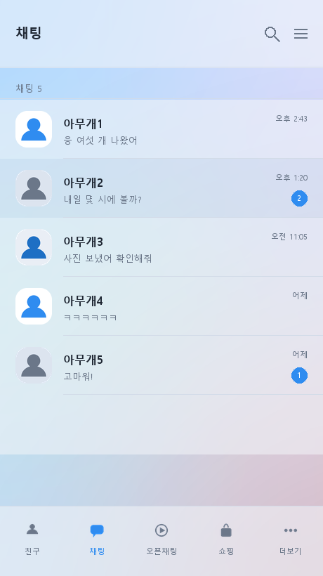  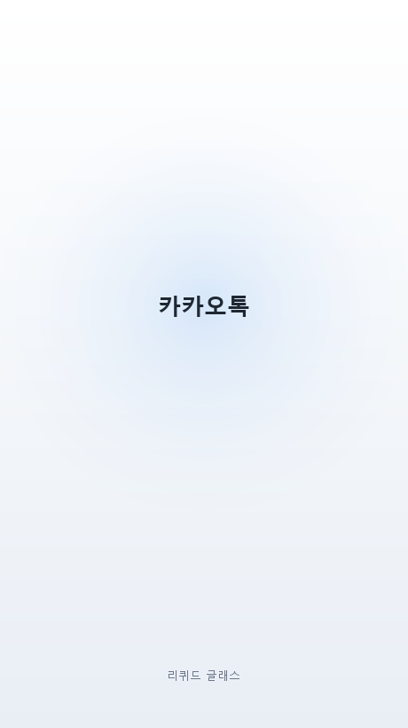

**다크** — 같은 유리를 어두운 쪽으로. 빛이 유리 모서리에만 걸림

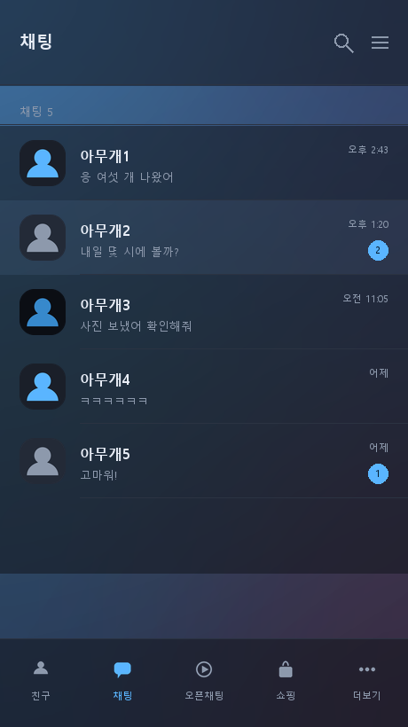 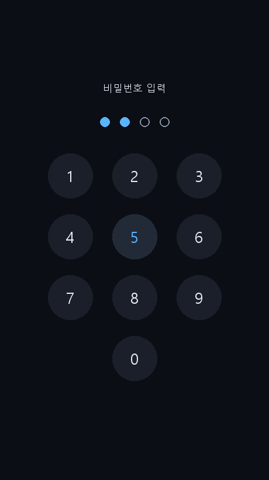 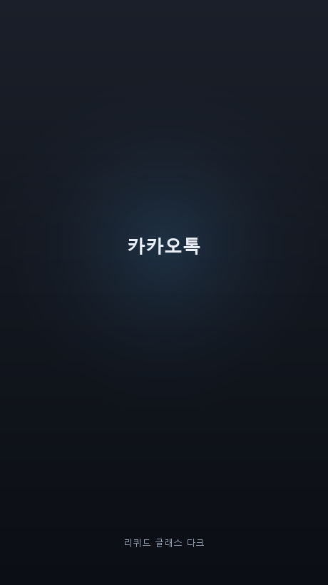

</details>

<a name="심야"></a>

###  심야

<table>
<tr>
<td width="50%" align="center"><br><b>기본</b><br><sub>밤하늘을 걷어낸 남색 바탕</sub><br><a href="https://github.com/Ruminem/kakaotalk-theme/releases/latest/download/midnight-basic.ktheme">iOS</a> · <a href="https://github.com/Ruminem/kakaotalk-theme/releases/latest/download/midnight-basic.apk">Android</a></td>
<td width="50%" align="center">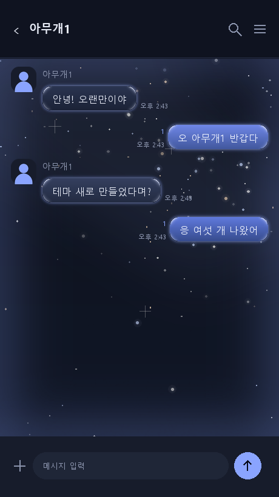<br><b>배경</b><br><sub>밤하늘을 그려 넣은 테마. 잠금화면에 달과 능선이 나옴</sub><br><a href="https://github.com/Ruminem/kakaotalk-theme/releases/latest/download/midnight-image.ktheme">iOS</a> · <a href="https://github.com/Ruminem/kakaotalk-theme/releases/latest/download/midnight-image.apk">Android</a></td>
</tr>
<tr>
<td width="50%" align="center">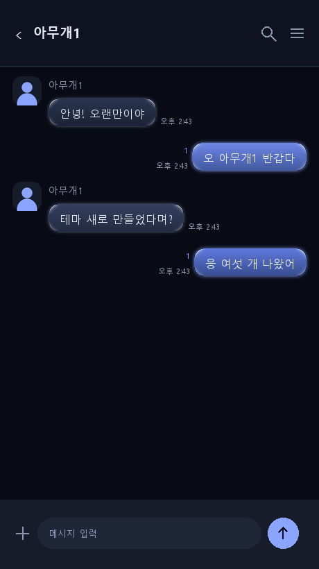<br><b>글로우</b><br><sub>말풍선이 달빛처럼 빛남</sub><br><a href="https://github.com/Ruminem/kakaotalk-theme/releases/latest/download/midnight-glow.ktheme">iOS</a> · <a href="https://github.com/Ruminem/kakaotalk-theme/releases/latest/download/midnight-glow.apk">Android</a></td>
<td width="50%" align="center">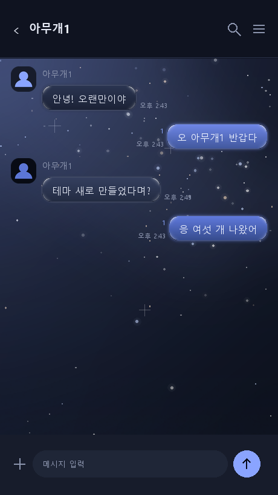<br><b>글로우+배경</b><br><sub>밤하늘에 빛나는 말풍선</sub><br><a href="https://github.com/Ruminem/kakaotalk-theme/releases/latest/download/midnight-glow-image.ktheme">iOS</a> · <a href="https://github.com/Ruminem/kakaotalk-theme/releases/latest/download/midnight-glow-image.apk">Android</a></td>
</tr>
</table>

<details><summary>화면 더 보기 (목록 · 잠금화면 · 실행화면)</summary>

**기본** — 밤하늘을 걷어낸 남색 바탕

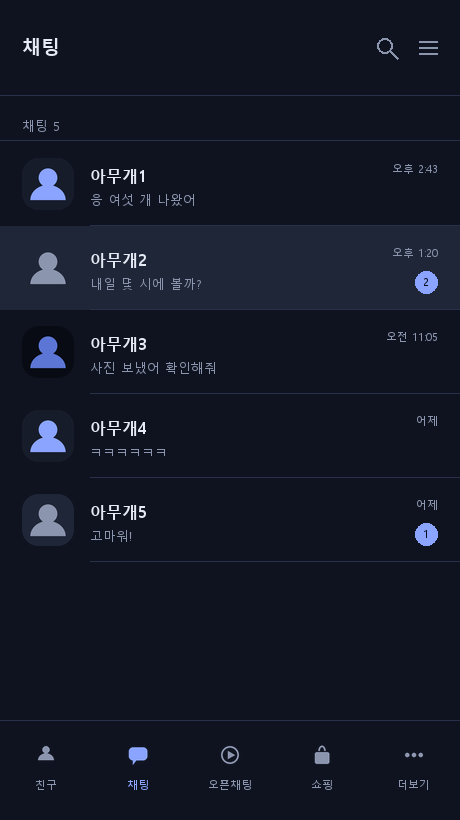 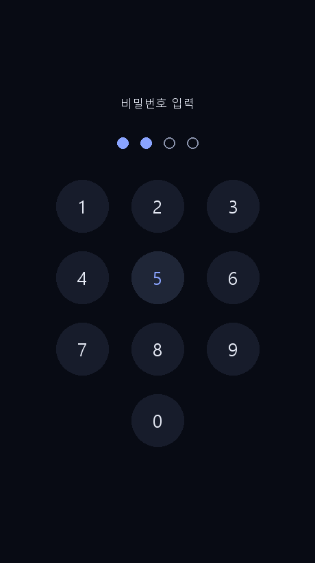 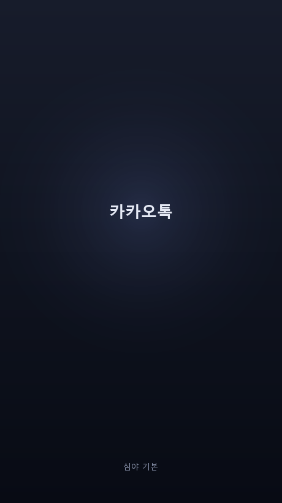

**배경** — 밤하늘을 그려 넣은 테마. 잠금화면에 달과 능선이 나옴

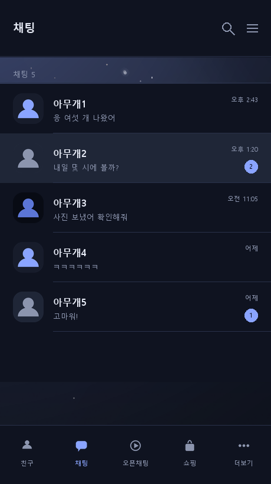 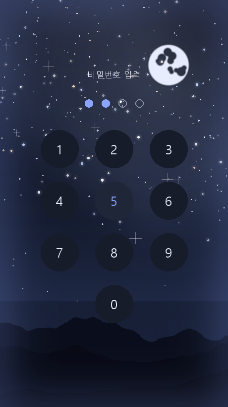 

**글로우** — 말풍선이 달빛처럼 빛남

  

**글로우+배경** — 밤하늘에 빛나는 말풍선

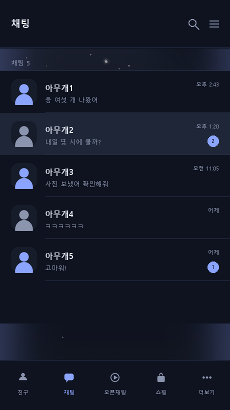 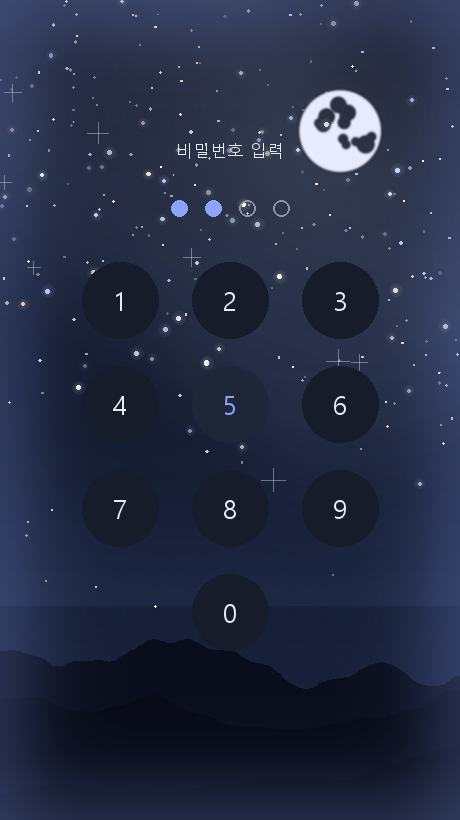 

</details>

<a name="바다"></a>

###  바다

<table>
<tr>
<td width="50%" align="center"><br><b>기본</b><br><sub>바다를 걷어낸 짙은 물빛 바탕</sub><br><a href="https://github.com/Ruminem/kakaotalk-theme/releases/latest/download/sea-basic.ktheme">iOS</a> · <a href="https://github.com/Ruminem/kakaotalk-theme/releases/latest/download/sea-basic.apk">Android</a></td>
<td width="50%" align="center">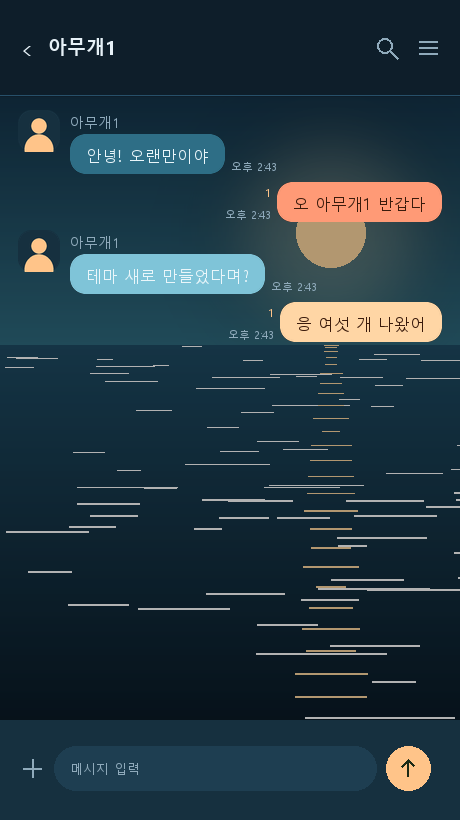<br><b>배경</b><br><sub>수평선 너머로 해가 지는 바다. 말풍선 네 칸이 산호·모래·물빛·하늘색</sub><br><a href="https://github.com/Ruminem/kakaotalk-theme/releases/latest/download/sea-image.ktheme">iOS</a> · <a href="https://github.com/Ruminem/kakaotalk-theme/releases/latest/download/sea-image.apk">Android</a></td>
</tr>
<tr>
<td width="50%" align="center">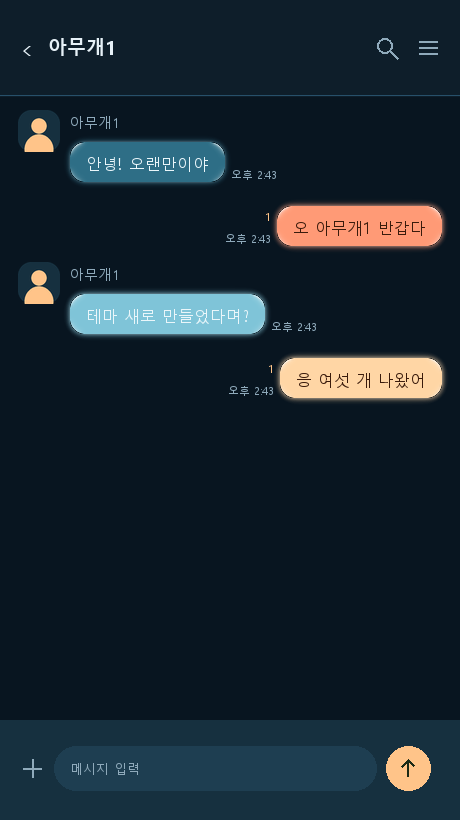<br><b>글로우</b><br><sub>산호와 물빛 말풍선이 빛남</sub><br><a href="https://github.com/Ruminem/kakaotalk-theme/releases/latest/download/sea-glow.ktheme">iOS</a> · <a href="https://github.com/Ruminem/kakaotalk-theme/releases/latest/download/sea-glow.apk">Android</a></td>
<td width="50%" align="center">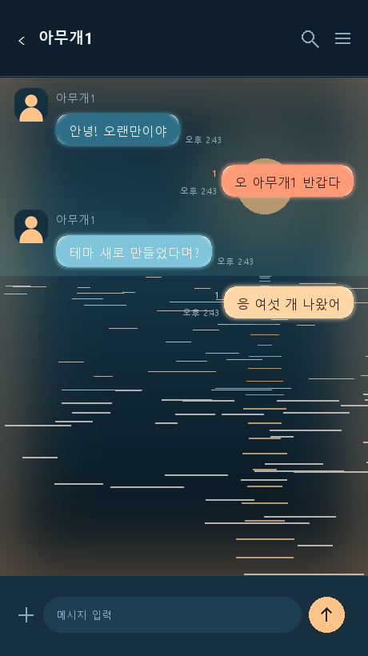<br><b>글로우+배경</b><br><sub>바다 배경에 빛나는 말풍선</sub><br><a href="https://github.com/Ruminem/kakaotalk-theme/releases/latest/download/sea-glow-image.ktheme">iOS</a> · <a href="https://github.com/Ruminem/kakaotalk-theme/releases/latest/download/sea-glow-image.apk">Android</a></td>
</tr>
</table>

<details><summary>화면 더 보기 (목록 · 잠금화면 · 실행화면)</summary>

**기본** — 바다를 걷어낸 짙은 물빛 바탕

  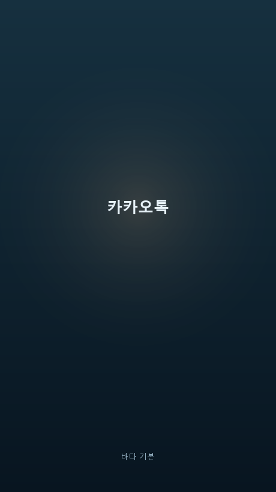

**배경** — 수평선 너머로 해가 지는 바다. 말풍선 네 칸이 산호·모래·물빛·하늘색

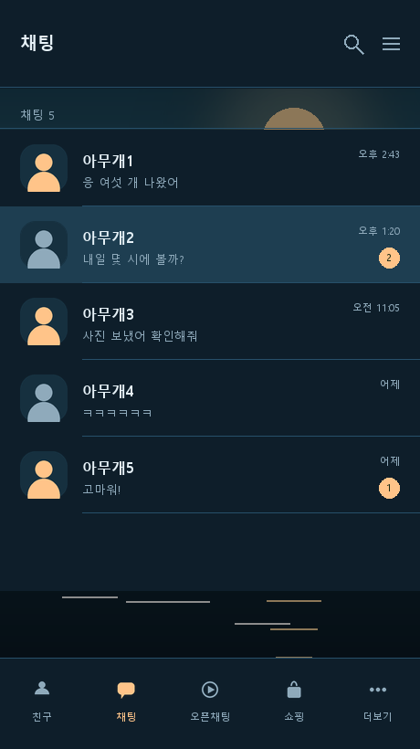 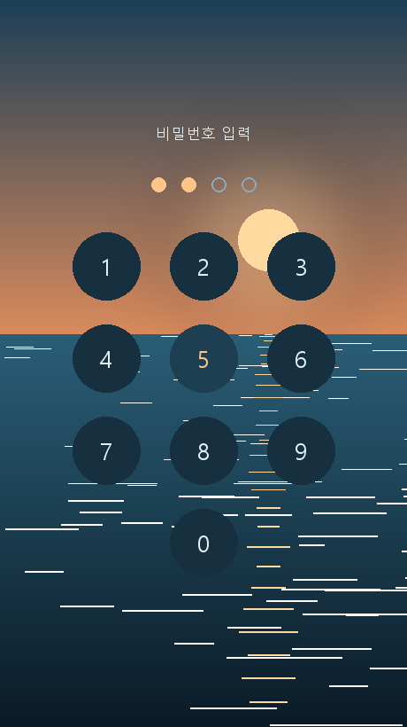 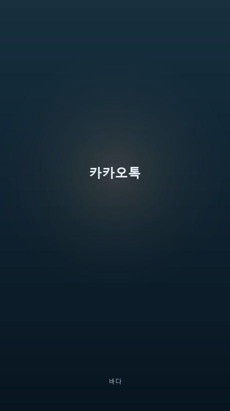

**글로우** — 산호와 물빛 말풍선이 빛남

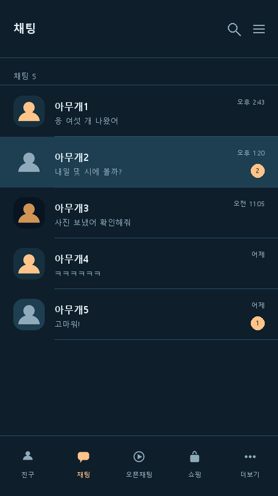 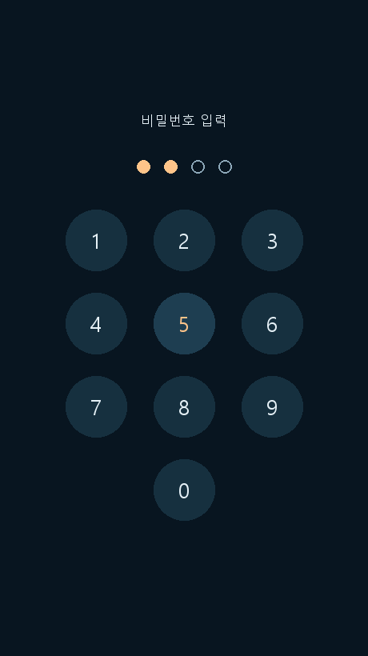 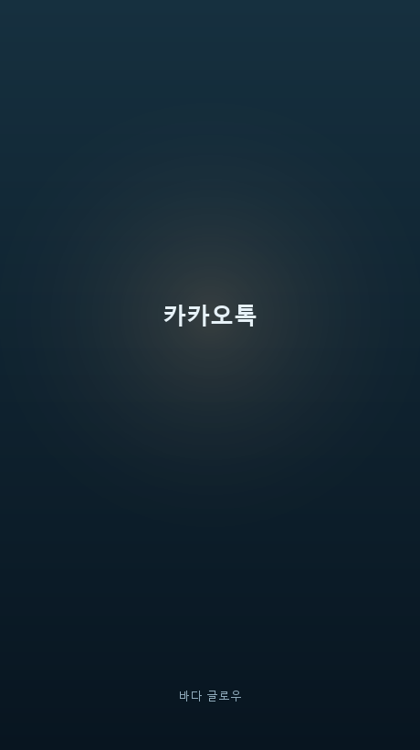

**글로우+배경** — 바다 배경에 빛나는 말풍선

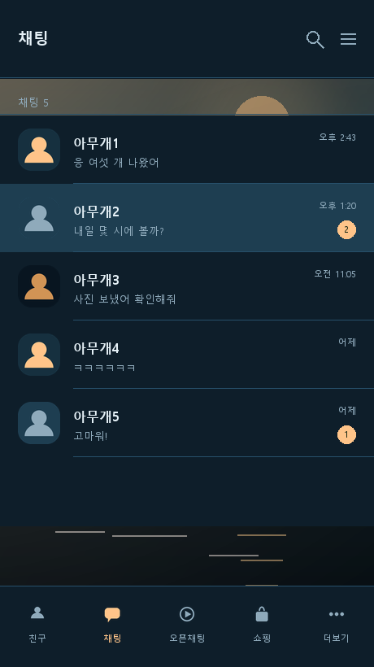 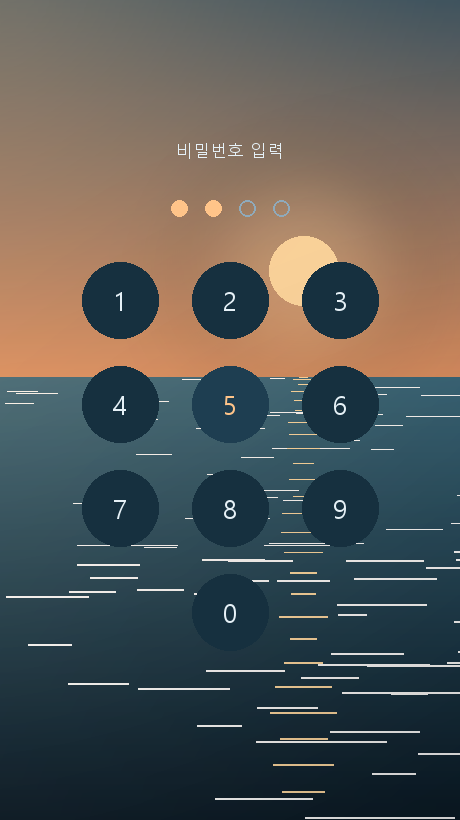 

</details>

<a name="숲"></a>

###  숲

<table>
<tr>
<td width="50%" align="center"><br><b>기본</b><br><sub>숲을 걷어낸 이끼빛 바탕</sub><br><a href="https://github.com/Ruminem/kakaotalk-theme/releases/latest/download/forest-basic.ktheme">iOS</a> · <a href="https://github.com/Ruminem/kakaotalk-theme/releases/latest/download/forest-basic.apk">Android</a></td>
<td width="50%" align="center">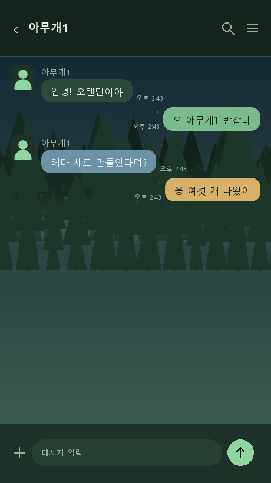<br><b>배경</b><br><sub>안개 낀 침엽수 숲. 이끼·호박·하늘·흙빛 말풍선</sub><br><a href="https://github.com/Ruminem/kakaotalk-theme/releases/latest/download/forest-image.ktheme">iOS</a> · <a href="https://github.com/Ruminem/kakaotalk-theme/releases/latest/download/forest-image.apk">Android</a></td>
</tr>
<tr>
<td width="50%" align="center">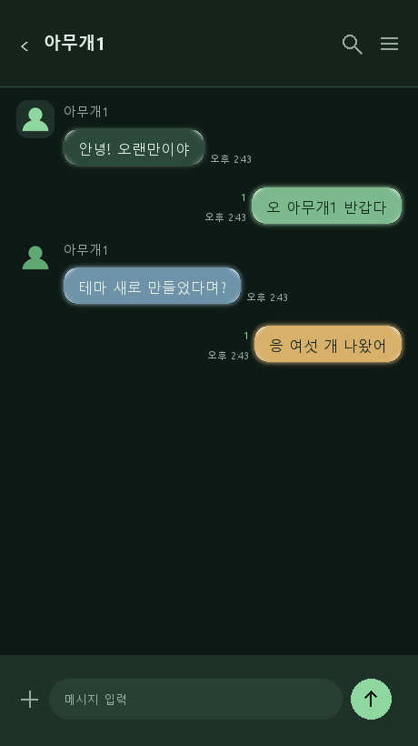<br><b>글로우</b><br><sub>이끼와 호박빛 말풍선이 빛남</sub><br><a href="https://github.com/Ruminem/kakaotalk-theme/releases/latest/download/forest-glow.ktheme">iOS</a> · <a href="https://github.com/Ruminem/kakaotalk-theme/releases/latest/download/forest-glow.apk">Android</a></td>
<td width="50%" align="center">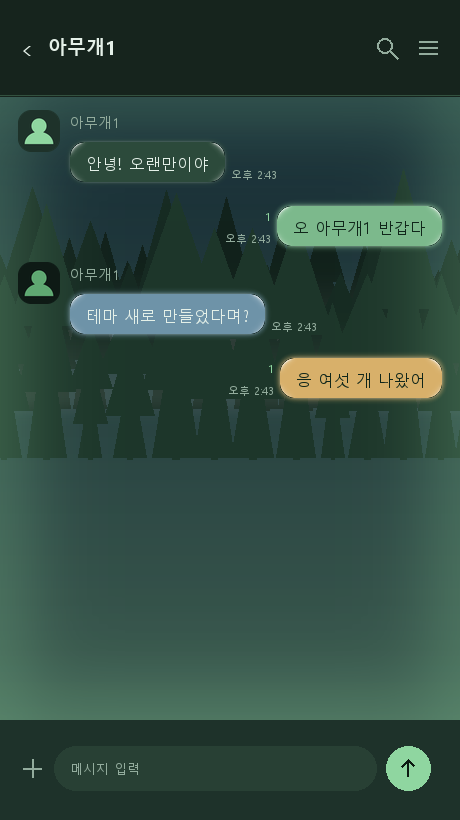<br><b>글로우+배경</b><br><sub>숲 배경에 빛나는 말풍선</sub><br><a href="https://github.com/Ruminem/kakaotalk-theme/releases/latest/download/forest-glow-image.ktheme">iOS</a> · <a href="https://github.com/Ruminem/kakaotalk-theme/releases/latest/download/forest-glow-image.apk">Android</a></td>
</tr>
</table>

<details><summary>화면 더 보기 (목록 · 잠금화면 · 실행화면)</summary>

**기본** — 숲을 걷어낸 이끼빛 바탕

  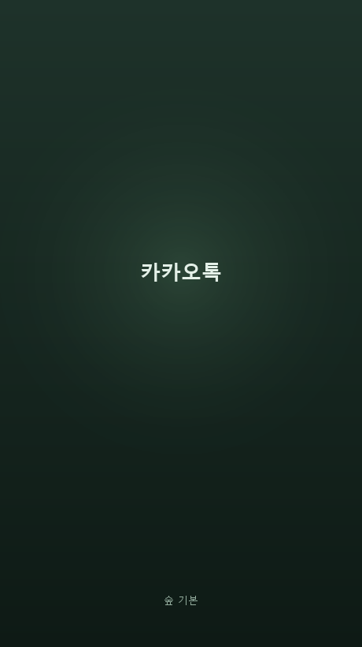

**배경** — 안개 낀 침엽수 숲. 이끼·호박·하늘·흙빛 말풍선

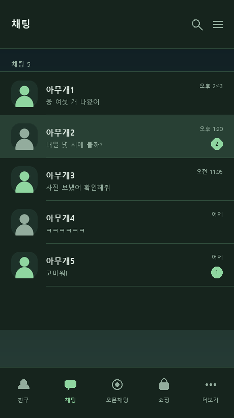 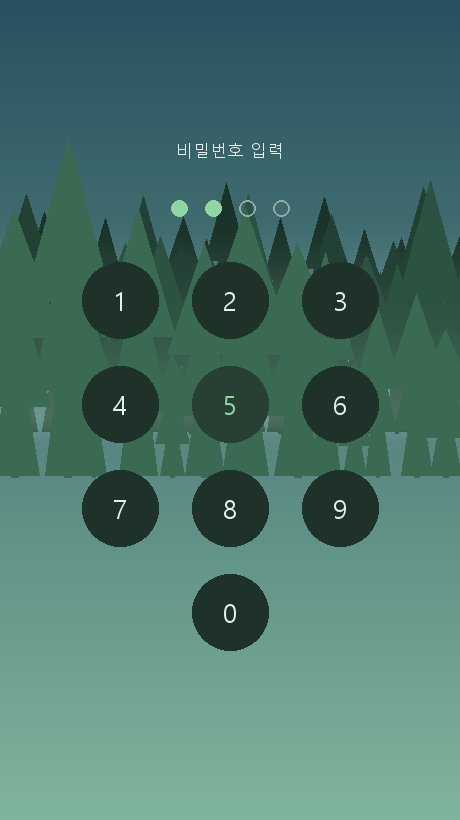 

**글로우** — 이끼와 호박빛 말풍선이 빛남

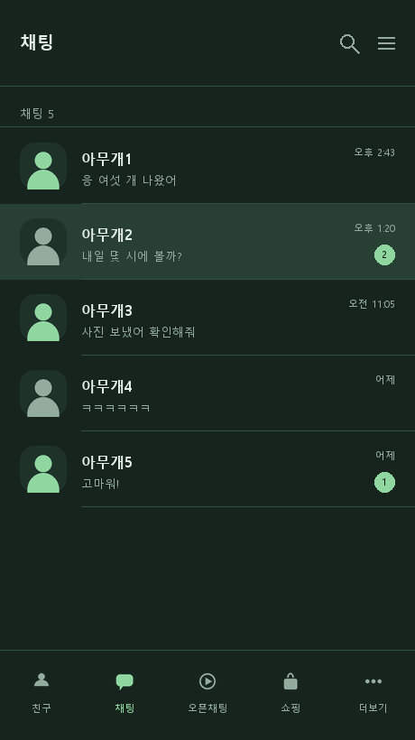 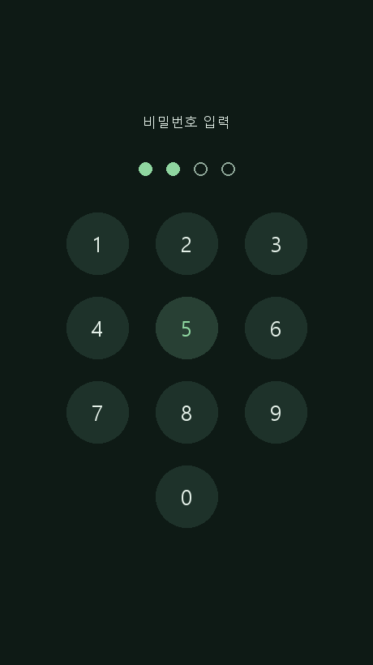 

**글로우+배경** — 숲 배경에 빛나는 말풍선

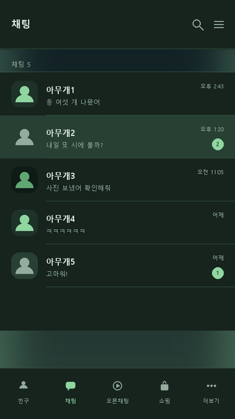 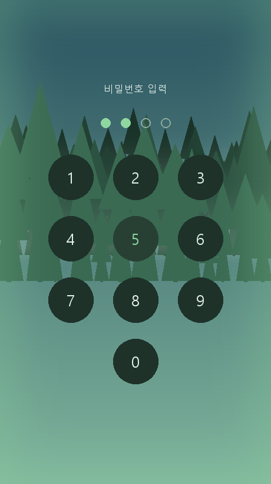 

</details>

<a name="설원"></a>

###  설원

<table>
<tr>
<td width="50%" align="center"><br><b>기본</b><br><sub>눈을 걷어낸 얼음빛 바탕</sub><br><a href="https://github.com/Ruminem/kakaotalk-theme/releases/latest/download/snow-basic.ktheme">iOS</a> · <a href="https://github.com/Ruminem/kakaotalk-theme/releases/latest/download/snow-basic.apk">Android</a></td>
<td width="50%" align="center">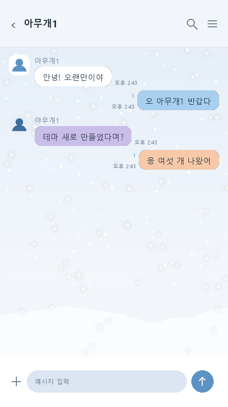<br><b>배경</b><br><sub>눈 내리는 언덕. 얼음·살구·민트·라벤더 말풍선</sub><br><a href="https://github.com/Ruminem/kakaotalk-theme/releases/latest/download/snow-image.ktheme">iOS</a> · <a href="https://github.com/Ruminem/kakaotalk-theme/releases/latest/download/snow-image.apk">Android</a></td>
</tr>
<tr>
<td width="50%" align="center"><br><b>글로우</b><br><sub>파스텔 말풍선이 은은하게 빛남</sub><br><a href="https://github.com/Ruminem/kakaotalk-theme/releases/latest/download/snow-glow.ktheme">iOS</a> · <a href="https://github.com/Ruminem/kakaotalk-theme/releases/latest/download/snow-glow.apk">Android</a></td>
<td width="50%" align="center">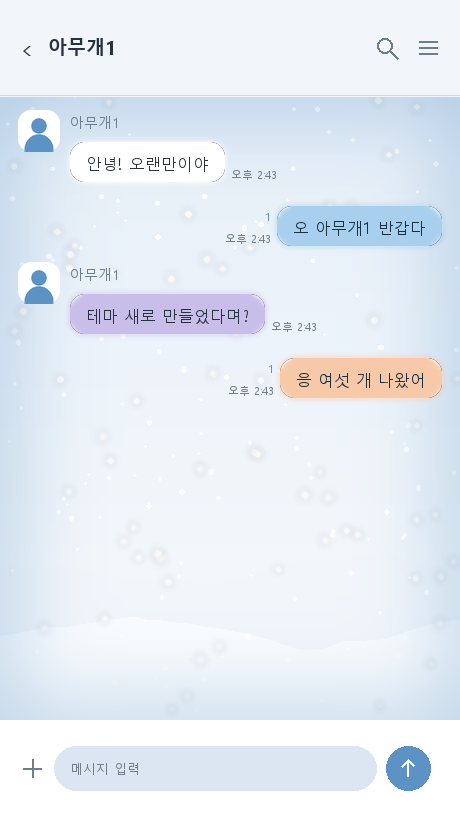<br><b>글로우+배경</b><br><sub>설원 배경에 빛나는 말풍선</sub><br><a href="https://github.com/Ruminem/kakaotalk-theme/releases/latest/download/snow-glow-image.ktheme">iOS</a> · <a href="https://github.com/Ruminem/kakaotalk-theme/releases/latest/download/snow-glow-image.apk">Android</a></td>
</tr>
</table>

<details><summary>화면 더 보기 (목록 · 잠금화면 · 실행화면)</summary>

**기본** — 눈을 걷어낸 얼음빛 바탕

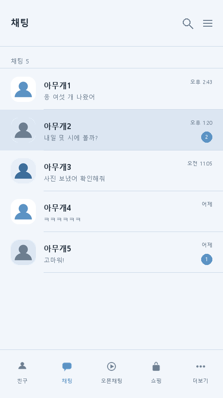  

**배경** — 눈 내리는 언덕. 얼음·살구·민트·라벤더 말풍선

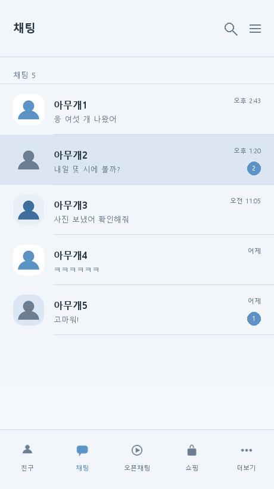 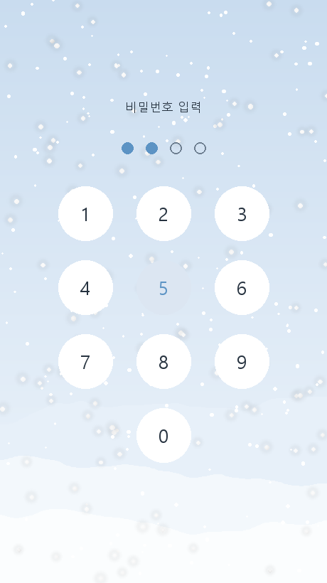 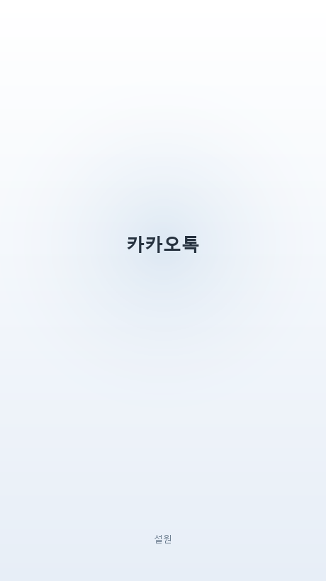

**글로우** — 파스텔 말풍선이 은은하게 빛남

 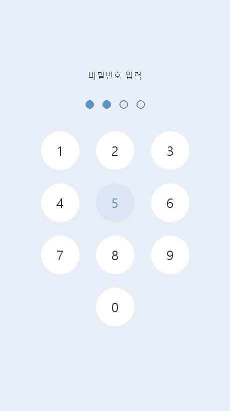 

**글로우+배경** — 설원 배경에 빛나는 말풍선

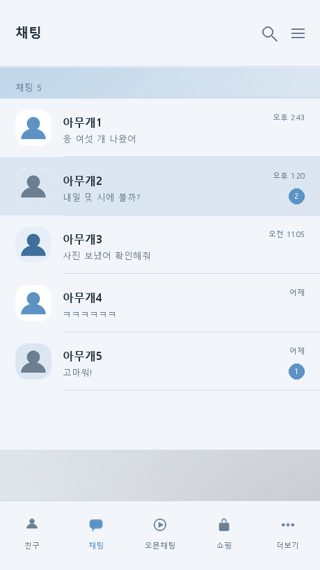 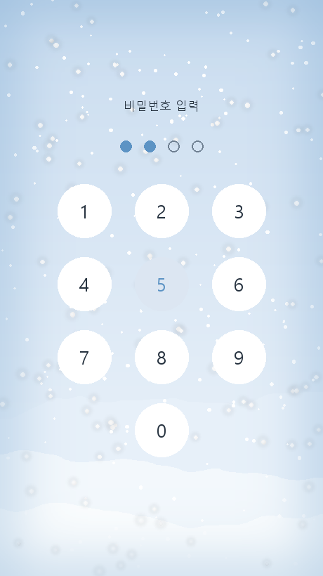 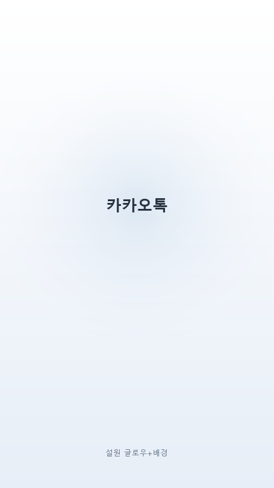

</details>

<a name="도형"></a>

###  도형

<table>
<tr>
<td width="50%" align="center"><br><b>기본</b><br><sub>도형을 걷어낸 미색 바탕</sub><br><a href="https://github.com/Ruminem/kakaotalk-theme/releases/latest/download/geo-basic.ktheme">iOS</a> · <a href="https://github.com/Ruminem/kakaotalk-theme/releases/latest/download/geo-basic.apk">Android</a></td>
<td width="50%" align="center">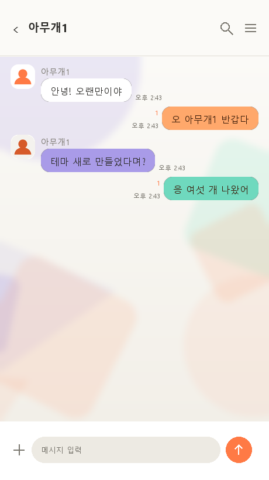<br><b>배경</b><br><sub>큰 도형이 겹친 무늬. 주황·민트·보라·하늘 말풍선</sub><br><a href="https://github.com/Ruminem/kakaotalk-theme/releases/latest/download/geo-image.ktheme">iOS</a> · <a href="https://github.com/Ruminem/kakaotalk-theme/releases/latest/download/geo-image.apk">Android</a></td>
</tr>
<tr>
<td width="50%" align="center">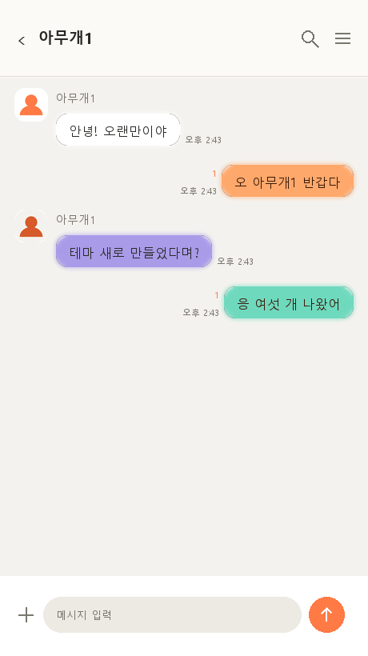<br><b>글로우</b><br><sub>주황과 민트 말풍선이 빛남</sub><br><a href="https://github.com/Ruminem/kakaotalk-theme/releases/latest/download/geo-glow.ktheme">iOS</a> · <a href="https://github.com/Ruminem/kakaotalk-theme/releases/latest/download/geo-glow.apk">Android</a></td>
<td width="50%" align="center">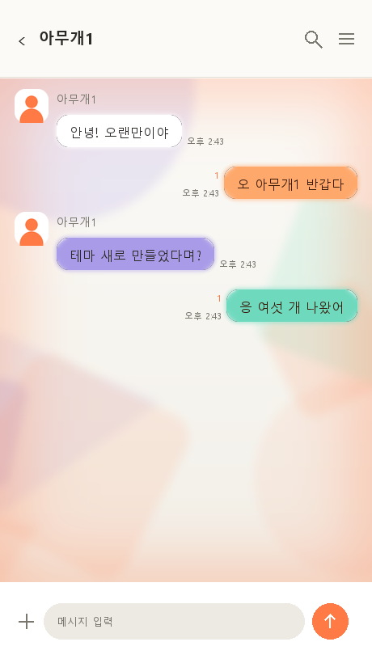<br><b>글로우+배경</b><br><sub>도형 배경에 빛나는 말풍선</sub><br><a href="https://github.com/Ruminem/kakaotalk-theme/releases/latest/download/geo-glow-image.ktheme">iOS</a> · <a href="https://github.com/Ruminem/kakaotalk-theme/releases/latest/download/geo-glow-image.apk">Android</a></td>
</tr>
</table>

<details><summary>화면 더 보기 (목록 · 잠금화면 · 실행화면)</summary>

**기본** — 도형을 걷어낸 미색 바탕

  

**배경** — 큰 도형이 겹친 무늬. 주황·민트·보라·하늘 말풍선

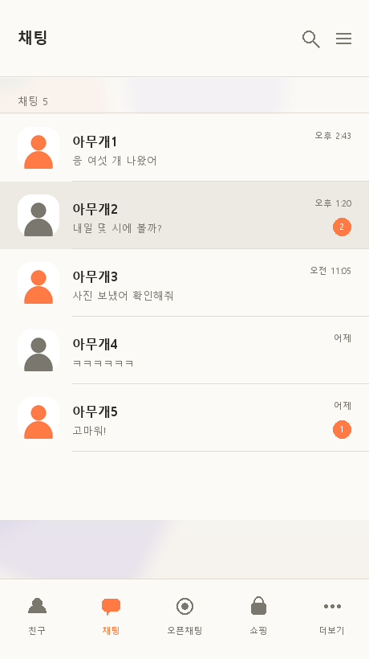 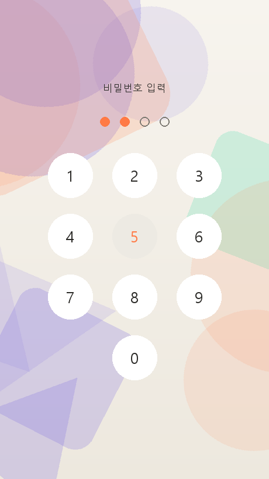 

**글로우** — 주황과 민트 말풍선이 빛남

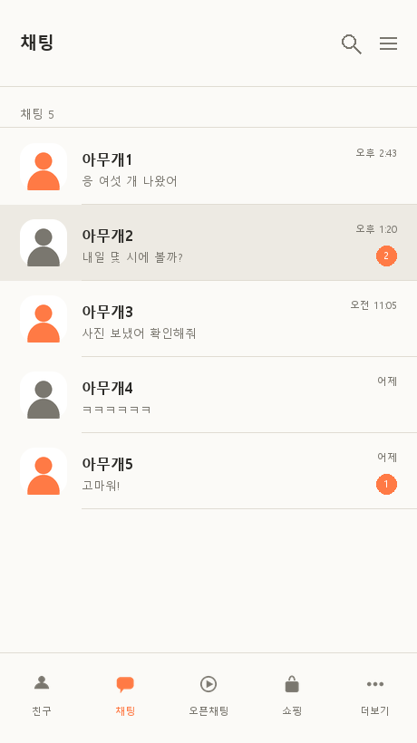 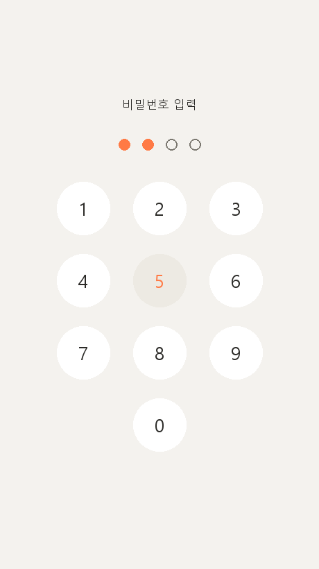 

**글로우+배경** — 도형 배경에 빛나는 말풍선

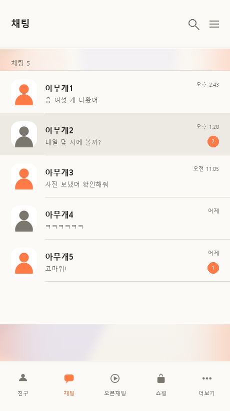 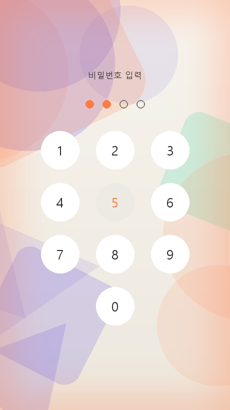 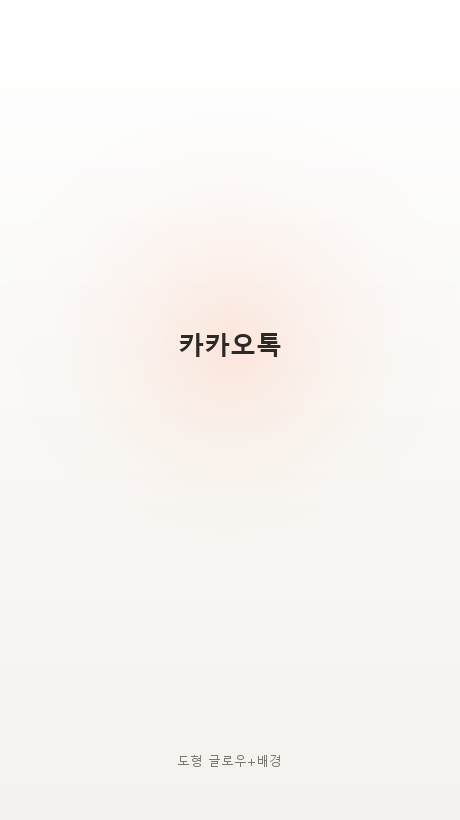

</details>

<a name="야경"></a>

###  야경

<table>
<tr>
<td width="50%" align="center"><br><b>기본</b><br><sub>담백한 남색 바탕. 네온 네 색 말풍선</sub><br><a href="https://github.com/Ruminem/kakaotalk-theme/releases/latest/download/city-basic.ktheme">iOS</a> · <a href="https://github.com/Ruminem/kakaotalk-theme/releases/latest/download/city-basic.apk">Android</a></td>
<td width="50%" align="center">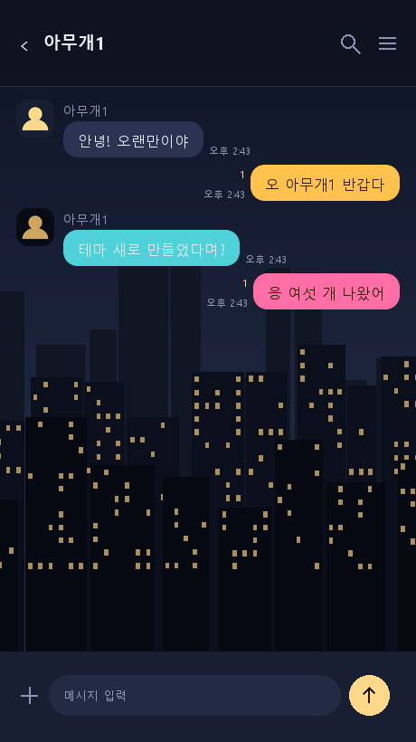<br><b>배경</b><br><sub>창문 불빛이 켜진 도시가 깔림</sub><br><a href="https://github.com/Ruminem/kakaotalk-theme/releases/latest/download/city-image.ktheme">iOS</a> · <a href="https://github.com/Ruminem/kakaotalk-theme/releases/latest/download/city-image.apk">Android</a></td>
</tr>
<tr>
<td width="50%" align="center">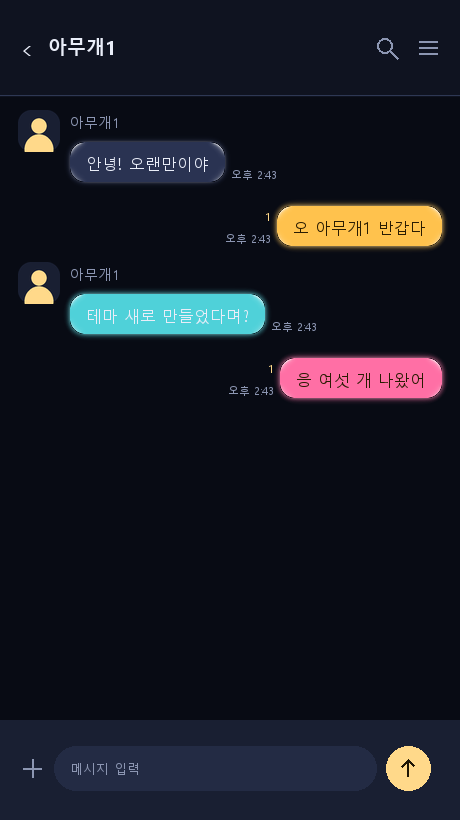<br><b>글로우</b><br><sub>말풍선이 네온처럼 빛남</sub><br><a href="https://github.com/Ruminem/kakaotalk-theme/releases/latest/download/city-glow.ktheme">iOS</a> · <a href="https://github.com/Ruminem/kakaotalk-theme/releases/latest/download/city-glow.apk">Android</a></td>
<td width="50%" align="center">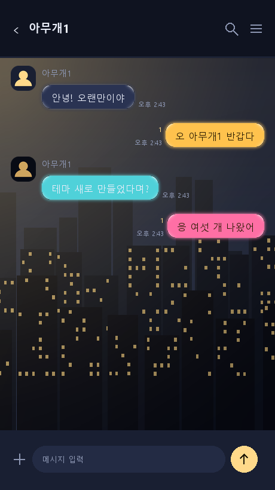<br><b>글로우+배경</b><br><sub>도시 배경 위에 네온 말풍선까지</sub><br><a href="https://github.com/Ruminem/kakaotalk-theme/releases/latest/download/city-glow-image.ktheme">iOS</a> · <a href="https://github.com/Ruminem/kakaotalk-theme/releases/latest/download/city-glow-image.apk">Android</a></td>
</tr>
</table>

<details><summary>화면 더 보기 (목록 · 잠금화면 · 실행화면)</summary>

**기본** — 담백한 남색 바탕. 네온 네 색 말풍선

  

**배경** — 창문 불빛이 켜진 도시가 깔림

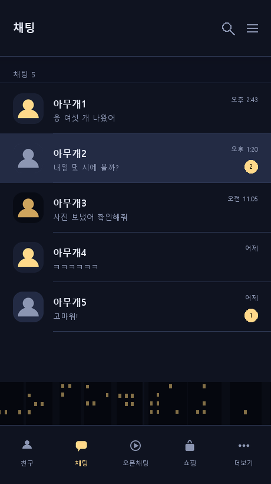 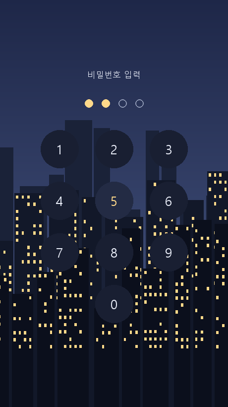 

**글로우** — 말풍선이 네온처럼 빛남

 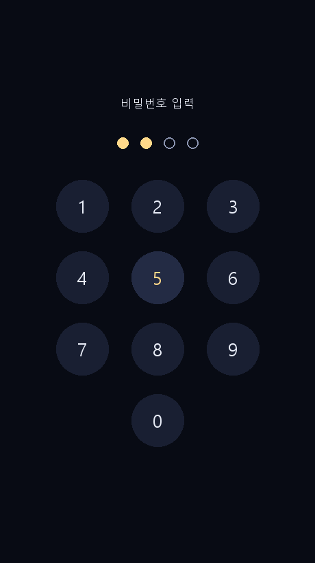 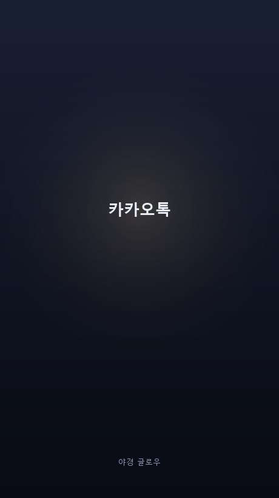

**글로우+배경** — 도시 배경 위에 네온 말풍선까지

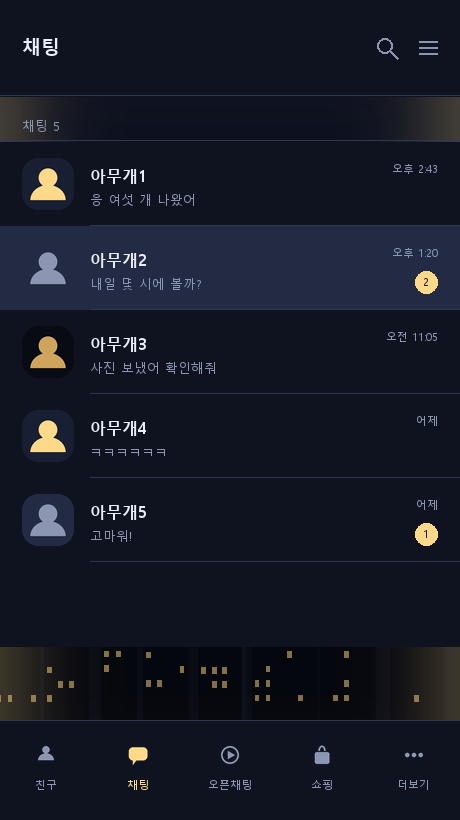 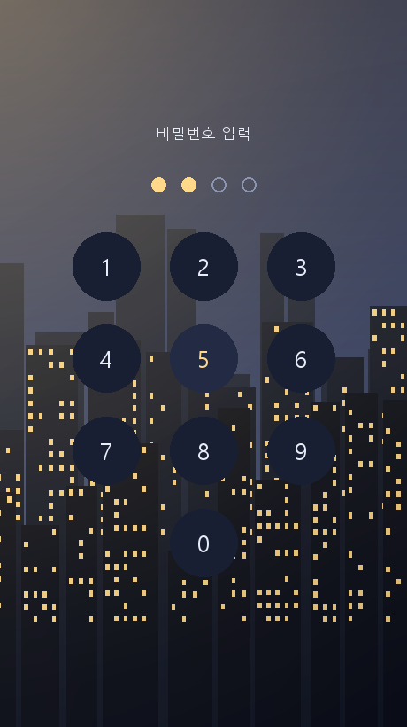 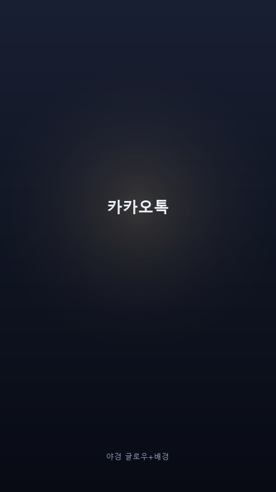

</details>

<!-- THEMES:END -->

---

## 받는 법

### 폰에서 바로 받기

PC로 받아서 폰으로 옮길 필요 없음. 카메라로 찍으면 릴리스 목록으로 감.

| iOS | Android |
|---|---|
|  |  |

**iOS** — 받은 뒤 파일 앱 > 다운로드에서 `.ktheme` 을 길게 눌러 **공유 → 카카오톡**.
카카오톡으로 파일을 건네는 이 단계는 없앨 수 없음. 테마를 받는 경로가 그것뿐임.

**Android** — 받은 뒤 알림을 눌러 설치. "출처를 알 수 없는 앱" 허용이 한 번 필요함.
설치 후 카톡 더보기 > 설정 > 테마 설정.

### 한 번에 하고 싶으면 (iOS 단축어)

단축어 앱에서 세 동작짜리를 만들면 홈 화면 아이콘 한 번으로 공유 시트까지 감.

1. **URL** — `https://github.com/Ruminem/kakaotalk-theme/releases/latest/download/inkmint01.ktheme`
2. **URL의 콘텐츠 가져오기**
3. **공유 시트 보기**

홈 화면에 추가하면 누를 때마다 최신 테마를 받아서 공유 시트를 띄움. 거기서 카카오톡만 고르면 됨.
링크가 `latest` 라 새 버전이 나와도 그대로 씀. 테마를 바꾸려면 URL의 파일 이름만 바꾸면 됨.

---

## 만들기

원본은 [tools/themes.py](tools/themes.py) 팔레트 표 **하나뿐**임.
CSS도 `colors.xml`도 말풍선 그림도 미리보기도 전부 거기서 나옴.
새 테마를 만들려면 그 표에 한 덩어리 더 쓰면 됨.

```powershell
powershell -ExecutionPolicy Bypass -File preview.ps1   # 그림 다시 그리고 브라우저로 열기
powershell -ExecutionPolicy Bypass -File build.ps1     # 전부 빌드 → dist/
```

미리보기는 테마마다 목록·채팅방·실행화면 세 장을 그림.
**폰에 하나씩 적용해보지 않고 색을 확인하려고** 만든 것임.

```
tools/themes.py     ← 팔레트 표. 여기만 고침
tools/gen.py        → build-src/<테마>/{ios,android}/
tools/preview.py    → docs/preview-*.png, docs/index.html
build.ps1           → dist/iOS/*.ktheme, dist/android/*.apk
release.ps1         → 태그 + 릴리스 자산 첨부
```

`dist/`, `build-src/`, `theme.keystore` 는 저장소에 안 들어감. 받는 사람은 릴리스 자산에서 받음.

### 필요한 것

- 파이썬 + Pillow (`pip install Pillow`) — 생성기
- 안드로이드 SDK (aapt2, zipalign, apksigner) + JDK — APK 빌드. gradle은 안 씀
- iOS 쪽은 따로 없음. zip으로 묶는 게 전부임

---

## 규격 메모

**[할 수 있는 것 전부 정리 → docs/spec.md](docs/spec.md)** — 색·이미지 슬롯 목록,
지금까지 쓴 기법, 아직 안 쓴 재료, 안 되는 것.

아래는 요약임. 두 플랫폼은 방식이 완전히 다름. `.ktheme` 을 안드로이드에 넣을 수 없고 반대도 안 됨.

|  | iOS | Android |
|---|---|---|
| 파일 | `.ktheme` (확장자만 바꾼 zip) | `.apk` (앱) |
| 내용 | 유사 CSS + PNG | `colors.xml` + 9-patch PNG |
| 빌드 | 텍스트 편집 + 압축 | aapt2 → zipalign → apksigner |
| 말풍선 색 | **PNG로만 됨** | 색상값으로도 됨 |
| 실행화면 | **없음** | `theme_splash_image` |

### iOS

일반 CSS가 아님. 셀렉터가 없고 **블록 이름이 카카오에 의해 고정**돼 있음.
없는 이름을 쓰면 오류가 아니라 그냥 무시됨. 그래서 오타가 제일 위험함.

| 블록 | 무엇 |
|---|---|
| `ManifestStyle` | 테마 이름 / 버전 / 작성자 / ID |
| `TabBarStyle-Main` | 하단 탭바 배경과 아이콘 8종 |
| `HeaderStyle-Main` | 상단 제목줄 |
| `MainViewStyle-Primary` / `-Secondary` | 목록 본문 / 2차 화면 |
| `SectionTitleStyle-Main` | "친구 24" 같은 구분 머리줄 |
| `FeatureStyle-Primary` | 강조 텍스트 |
| `ButtonStyle-AddFriend`, `DefaultProfileStyle` | 친구추가 버튼, 기본 프로필 |
| `BackgroundStyle-ChatRoom` | 채팅방 바닥 |
| `InputBarStyle-Chat` | 채팅 입력바와 전송 버튼 |
| `MessageCellStyle-Send` / `-Receive` | 말풍선 |
| `BackgroundStyle-Passcode`, `LabelStyle-PasscodeTitle`, `PasscodeStyle` | 잠금화면 |
| `BackgroundStyle-MessageNotificationBar`, `LabelStyle-MessageNotificationBar*` | 알림 배너 |
| `BackgroundStyle-DirectShareBar`, `LabelStyle-DirectShareBar*` | 공유 시트 |
| `BottomBannerStyle` | 하단 배너 |

- 이미지는 `'파일명.png' 18px 18px` 형태. 뒤의 숫자 두 개가 **늘어나지 않는 가장자리**(cap inset)고
  안드로이드 9-patch에 해당함. 모서리 둥글기를 바꾸면 같이 손봐야 함.
- 파일명은 `@2x` / `@3x` 없이 쓰고, 실제 파일만 `Images/name@2x.png` 로 둠.
- `-ios-*-alpha` 는 0.0~1.0. 1 미만이면 뒤 배경이 비침.

### Android

- 패키지 이름이 `com.kakao.talk.theme.` 로 시작해야 테마로 인식됨. 뒷부분은 고유해야 함.
- **권한을 하나도 요구하지 않음.** 설치할 때 권한 안내가 뜨면 뭔가 잘못된 것임.
- 색은 `colors.xml`, 이미지는 `res/drawable-xxhdpi/`. 말풍선은 이미지가 색상값을 이김.
- 서명은 아무 키나 상관없지만 **같은 키로 계속 서명해야** 덮어 설치가 됨.

### 말풍선을 세로 그라데이션으로 그리는 이유

말풍선은 글자 길이에 따라 가로로 늘어남. 세로 그라데이션이면 각 줄의 색이 유지되지만,
가로 그라데이션이면 늘어나면서 뭉개짐.

---

## 참고

리소스 이름은 전부 카카오 공식 가이드에서 가져왔음.

- [iOS 사용자 테마 가이드 (9.2.5)](https://t1.kakaocdn.net/kakaocorp/Service/Theme/KakaoTalk/9.2.5_UserThemeGuide_iOS.pdf)
- [Android 사용자 테마 가이드 (9.2.5)](https://t1.kakaocdn.net/kakaocorp/Service/Theme/KakaoTalk/9.2.5_UserThemeGuide_Android.pdf)

가이드 PDF는 폰트 인코딩이 밀려 있어서 그냥 열면 안 읽힘. 글자 코드에 +31 하면 영문이 나옴.
