# 카카오톡 테마

직접 만든 카카오톡 테마 모음임. iOS(`.ktheme`)와 안드로이드(`.apk`) 양쪽으로 냄.

색은 팔레트 표 한 곳에서만 관리하고, CSS·`colors.xml`·이미지·미리보기가 전부 거기서 생성됨.

---

## 테마

받는 링크는 항상 **최신 릴리스**를 가리킴. 지난 버전은 [릴리스 목록](https://github.com/Ruminem/kakaotalk-theme/releases)에 있음.
계열은 일곱 카테고리로 묶었음 — **무늬**는 색과 도형만, **편안함**은 채도를 낮춰 눈이 편한 쪽, **유리**는 반투명 말풍선, **자연**은 장면, **불빛**은 어둠 속 인공 불빛, **캐릭터**는 모양 있는 말풍선과 캐릭터 프로필, **도트**는 8비트 도트로 그린 말풍선과 화면임.
받기 링크와 화면 그림은 **카테고리 문서**에 있음. 아래 썸네일을 누르면 그 계열로 바로 감.
실행화면 그림은 **안드로이드에만 있음** — iOS 테마 규격에는 스플래시 블록이 아예 없음.

<!-- THEMES:START -->

<a name="theme-list"></a>

<sub>썸네일을 누르면 카테고리 문서의 그 계열로 감</sub>

**[무늬](docs/themes/pattern.md)** — 바탕에 색과 도형만. 담백한 쪽

<table>
<tr>
<td width="33%" align="center"><a href="docs/themes/pattern.md#user-content-먹빛-민트">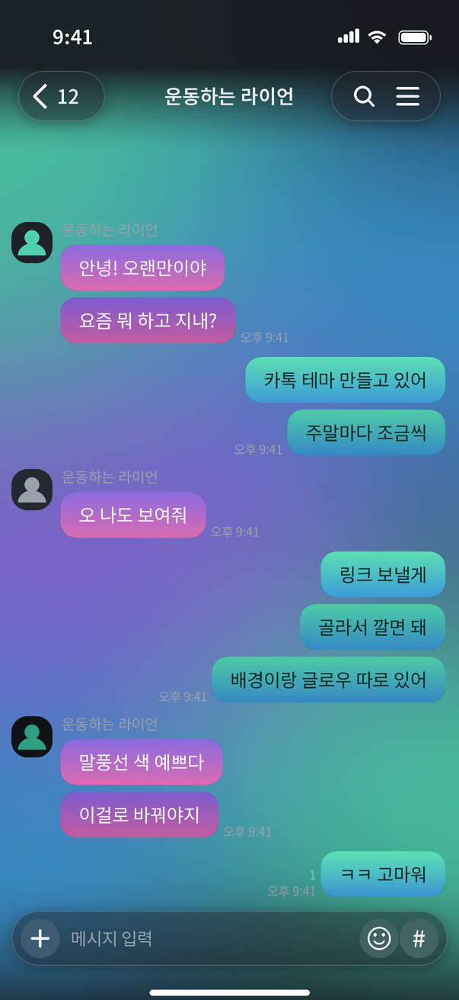</a></td>
<td width="33%" align="center"><a href="docs/themes/pattern.md#user-content-크림-라떼">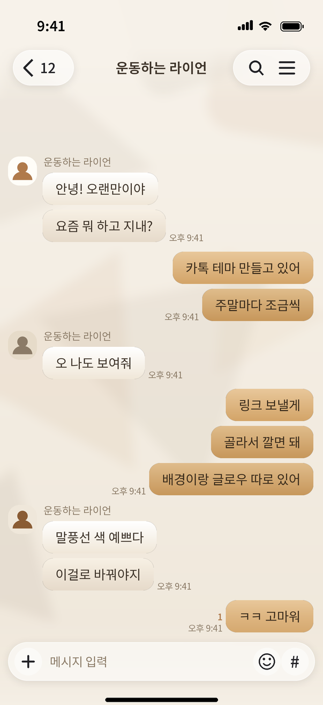</a></td>
<td width="33%" align="center"><a href="docs/themes/pattern.md#user-content-믹스드"></a></td>
</tr>
<tr>
<td align="center"><b><a href="docs/themes/pattern.md#user-content-먹빛-민트">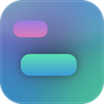 먹빛 민트</a></b><br><sub>기본 · 배경 · 글로우 · 글로우+배경</sub><br>먹색 바탕에 민트 포인트. 말풍선은 민트에서 하늘로, 보라에서 자주로 흐름</td>
<td align="center"><b><a href="docs/themes/pattern.md#user-content-크림-라떼">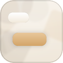 크림 라떼</a></b><br><sub>기본 · 배경 · 글로우 · 글로우+배경</sub><br>밝은 쪽. 베이지 바탕에 브라운. 눈이 제일 안 피로한 조합임</td>
<td align="center"><b><a href="docs/themes/pattern.md#user-content-믹스드">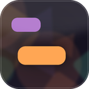 믹스드</a></b><br><sub>기본 · 배경 · 글로우 · 글로우+배경</sub><br>어두운 보라 바탕. 말풍선 네 칸이 전부 다른 색임</td>
</tr>
<tr>
<td width="33%" align="center"><a href="docs/themes/pattern.md#user-content-캔디-팝"></a></td>
<td width="33%" align="center"><a href="docs/themes/pattern.md#user-content-도형"></a></td>
<td width="33%" align="center"><a href="docs/themes/pattern.md#user-content-깅엄-체크">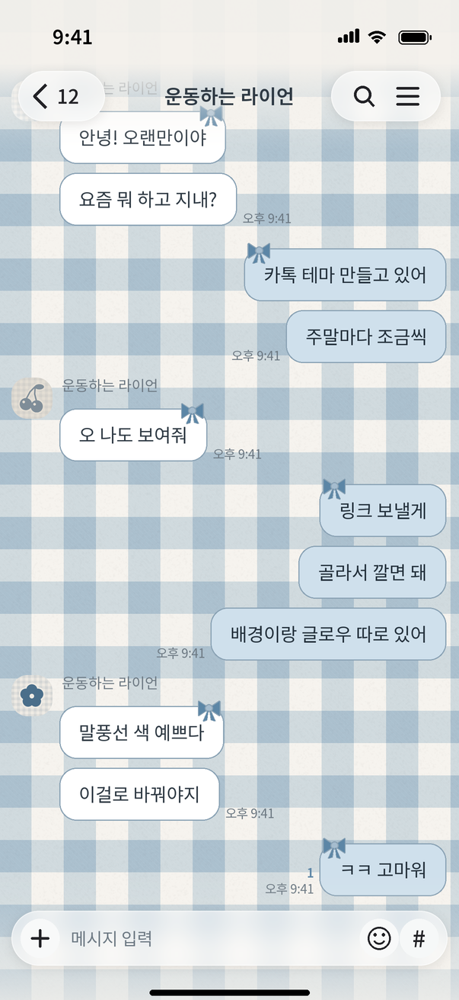</a></td>
</tr>
<tr>
<td align="center"><b><a href="docs/themes/pattern.md#user-content-캔디-팝">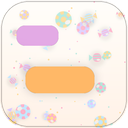 캔디 팝</a></b><br><sub>기본 · 사탕 배경 · 글로우 · 글로우+배경</sub><br>밝은 쪽 알록달록. 말풍선 네 칸이 전부 다르고 배경도 있음</td>
<td align="center"><b><a href="docs/themes/pattern.md#user-content-도형">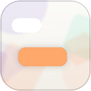 도형</a></b><br><sub>기본 · 배경 · 글로우 · 글로우+배경</sub><br>도형을 걷어낸 미색 바탕</td>
<td align="center"><b><a href="docs/themes/pattern.md#user-content-깅엄-체크">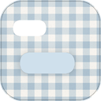 깅엄 체크</a></b><br><sub>밝음 · 밝음+배경 · 어두움 · 어두움+배경</sub><br>크림 바탕에 리본 단 말풍선</td>
</tr>
<tr>
<td width="33%" align="center"><a href="docs/themes/pattern.md#user-content-폴카-도트">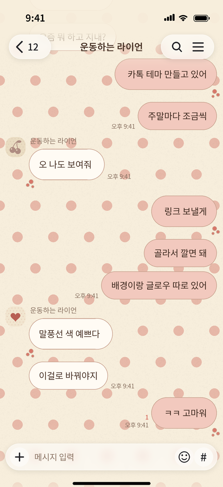</a></td>
<td width="33%" align="center"><a href="docs/themes/pattern.md#user-content-테라조">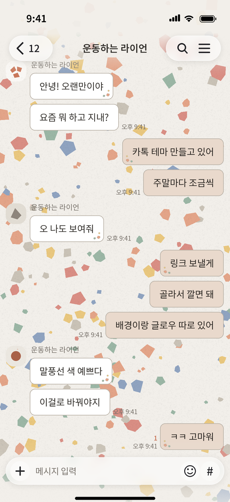</a></td>
<td width="33%" align="center"><a href="docs/themes/pattern.md#user-content-마린-스트라이프">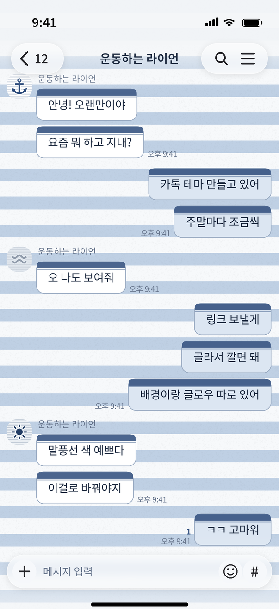</a></td>
</tr>
<tr>
<td align="center"><b><a href="docs/themes/pattern.md#user-content-폴카-도트">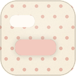 폴카 도트</a></b><br><sub>밝음 · 밝음+배경 · 어두움 · 어두움+배경</sub><br>크림 바탕에 알약 말풍선. 첫 말엔 물방울 셋</td>
<td align="center"><b><a href="docs/themes/pattern.md#user-content-테라조">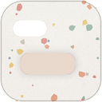 테라조</a></b><br><sub>밝음 · 밝음+배경 · 어두움 · 어두움+배경</sub><br>돌 조각이 박힌 말풍선</td>
<td align="center"><b><a href="docs/themes/pattern.md#user-content-마린-스트라이프">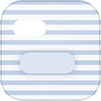 마린 스트라이프</a></b><br><sub>밝음 · 밝음+배경 · 어두움 · 어두움+배경</sub><br>남색 띠를 두른 말풍선</td>
</tr>
<tr>
<td width="33%" align="center"><a href="docs/themes/pattern.md#user-content-체커보드">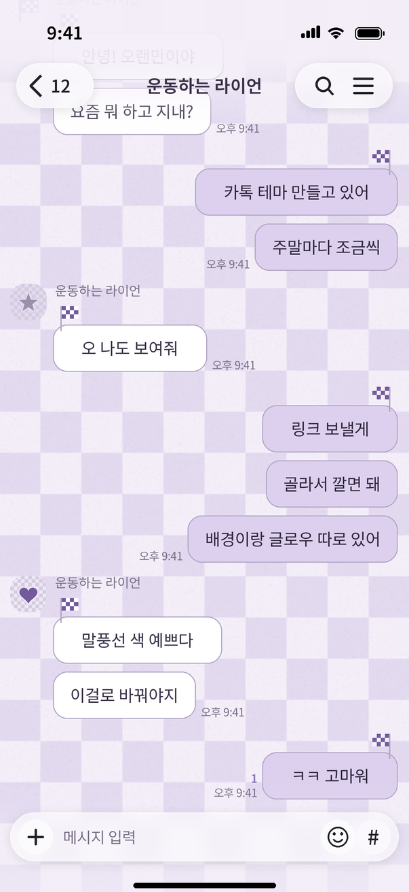</a></td>
<td width="33%"></td>
<td width="33%"></td>
</tr>
<tr>
<td align="center"><b><a href="docs/themes/pattern.md#user-content-체커보드">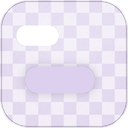 체커보드</a></b><br><sub>밝음 · 밝음+배경 · 어두움 · 어두움+배경</sub><br>첫 말에 체크 깃발 꽂은 말풍선</td>
<td width="33%"></td>
<td width="33%"></td>
</tr>
</table>

**[편안함](docs/themes/comfort.md)** — 채도를 낮춰 눈이 편한 쪽

<table>
<tr>
<td width="33%" align="center"><a href="docs/themes/comfort.md#user-content-고요">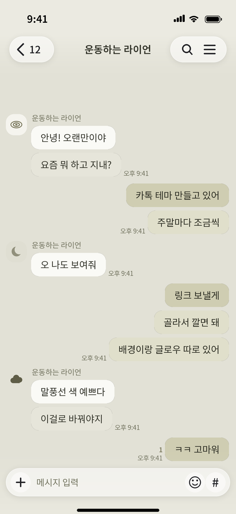</a></td>
<td width="33%" align="center"><a href="docs/themes/comfort.md#user-content-차분">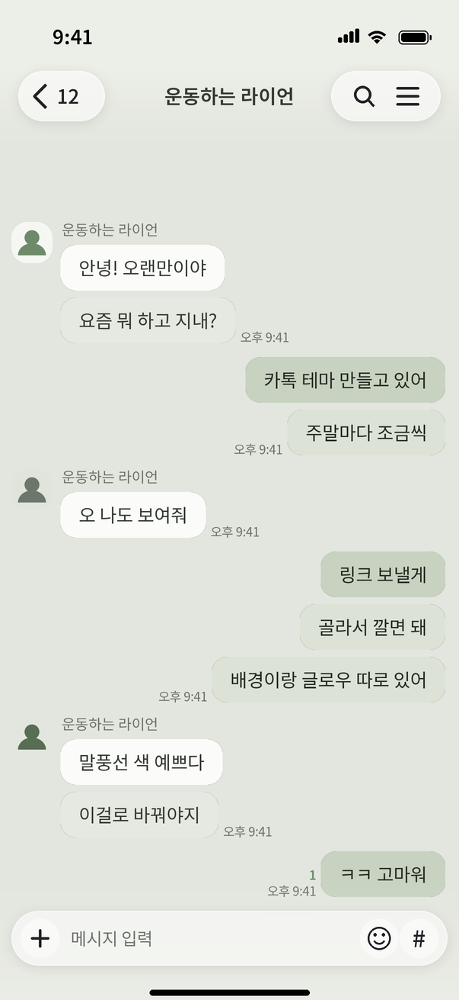</a></td>
<td width="33%" align="center"><a href="docs/themes/comfort.md#user-content-수채화">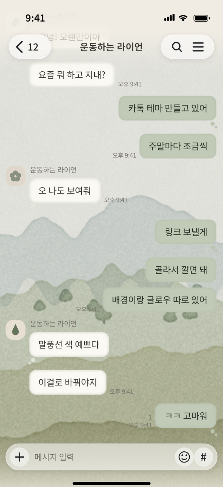</a></td>
</tr>
<tr>
<td align="center"><b><a href="docs/themes/comfort.md#user-content-고요">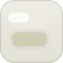 고요</a></b><br><sub>올리브 · 안개 · 자두 · 먹</sub><br>누런 풀빛 회색. 밝고 흙내 나는 쪽</td>
<td align="center"><b><a href="docs/themes/comfort.md#user-content-차분">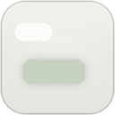 차분</a></b><br><sub>세이지 · 샌드 · 슬레이트 · 모카</sub><br>탁한 연둣빛 회색. 가장 순한 쪽</td>
<td align="center"><b><a href="docs/themes/comfort.md#user-content-수채화">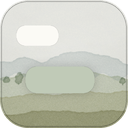 수채화</a></b><br><sub>밝음 · 밝음+배경 · 어두움 · 어두움+배경</sub><br>물감 번진 말풍선. 첫 말엔 물감 방울</td>
</tr>
<tr>
<td width="33%" align="center"><a href="docs/themes/comfort.md#user-content-수묵화">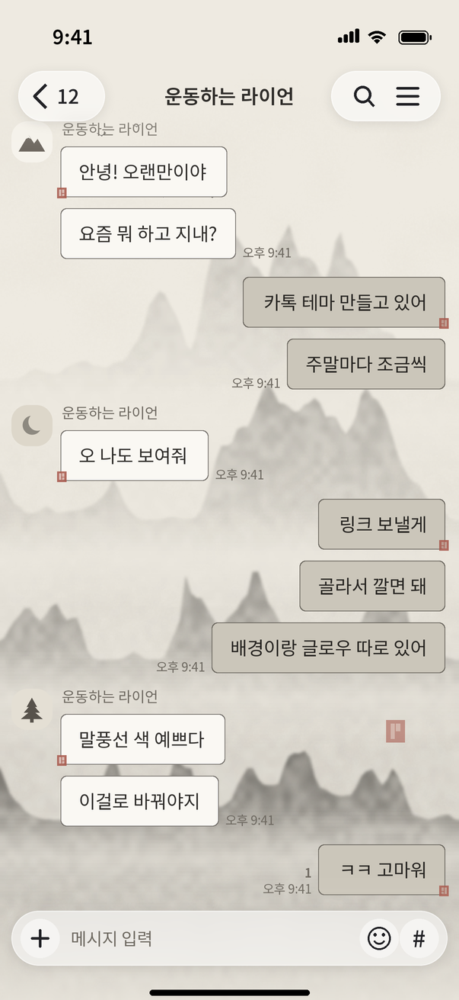</a></td>
<td width="33%" align="center"><a href="docs/themes/comfort.md#user-content-비-오는-창가">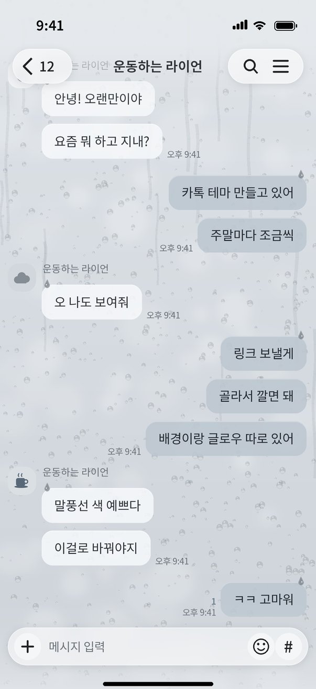</a></td>
<td width="33%" align="center"><a href="docs/themes/comfort.md#user-content-페이퍼컷">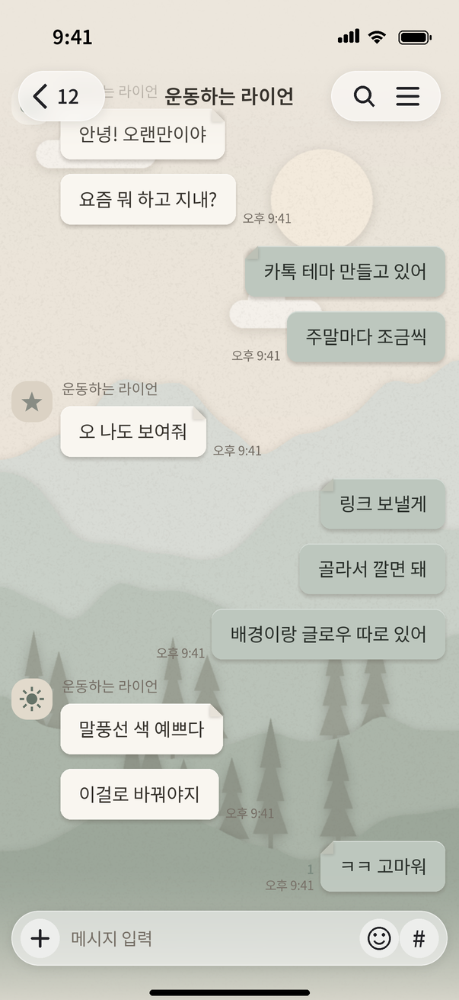</a></td>
</tr>
<tr>
<td align="center"><b><a href="docs/themes/comfort.md#user-content-수묵화">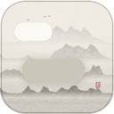 수묵화</a></b><br><sub>밝음 · 밝음+배경 · 어두움 · 어두움+배경</sub><br>한지 말풍선에 먹선. 첫 말엔 붉은 낙관</td>
<td align="center"><b><a href="docs/themes/comfort.md#user-content-비-오는-창가">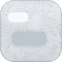 비 오는 창가</a></b><br><sub>밝음 · 밝음+배경 · 어두움 · 어두움+배경</sub><br>김 서린 유리 말풍선. 첫 말엔 물방울</td>
<td align="center"><b><a href="docs/themes/comfort.md#user-content-페이퍼컷">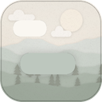 페이퍼컷</a></b><br><sub>밝음 · 밝음+배경 · 어두움 · 어두움+배경</sub><br>그림자 진 종이 말풍선. 첫 말엔 접힌 귀퉁이</td>
</tr>
</table>

**[유리](docs/themes/glass.md)** — 말풍선이 반투명하다

<table>
<tr>
<td width="33%" align="center"><a href="docs/themes/glass.md#user-content-리퀴드-글래스">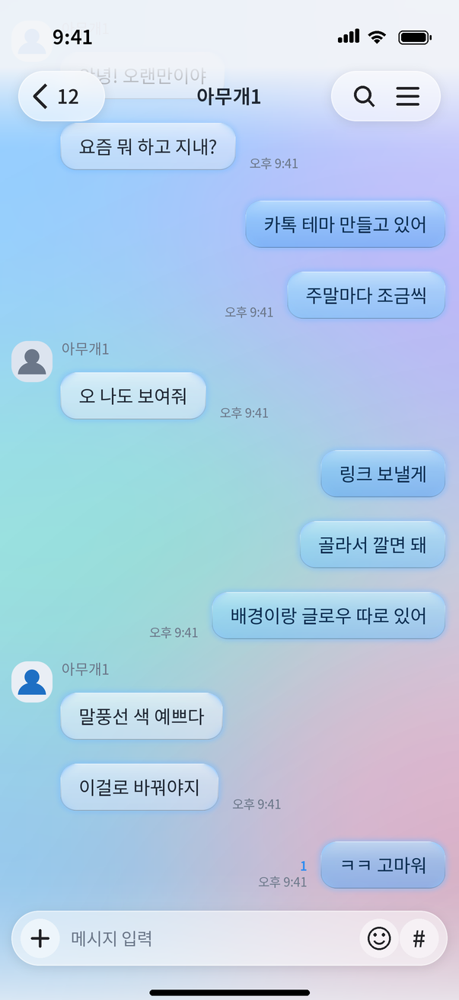</a></td>
<td width="33%" align="center"><a href="docs/themes/glass.md#user-content-원목-글래스">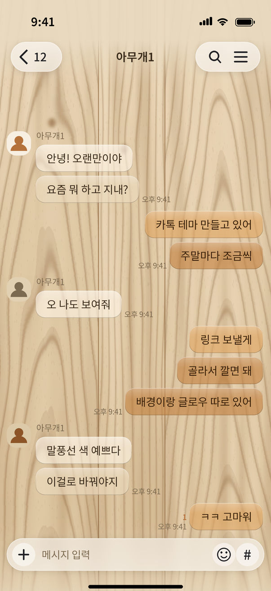</a></td>
<td width="33%" align="center"><a href="docs/themes/glass.md#user-content-스테인드-글래스">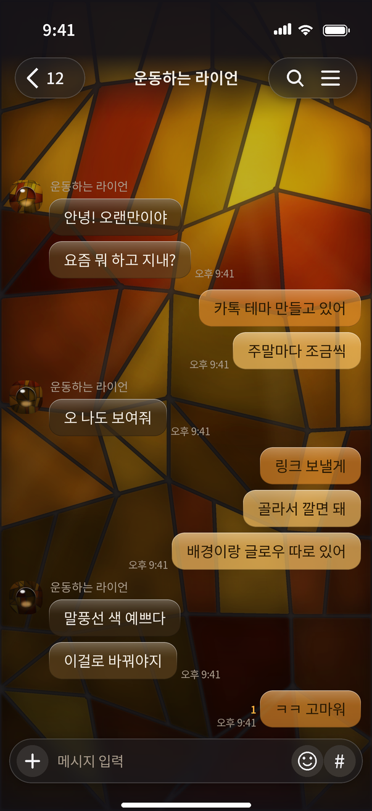</a></td>
</tr>
<tr>
<td align="center"><b><a href="docs/themes/glass.md#user-content-리퀴드-글래스">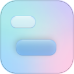 리퀴드 글래스</a></b><br><sub>라이트 · 다크 · 라이트 단색 · 다크 단색</sub><br>유리 너머로 빛이 번지는 밝은 쪽. 말풍선과 목록이 반투명이라 배경이 비침</td>
<td align="center"><b><a href="docs/themes/glass.md#user-content-원목-글래스">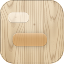 원목 글래스</a></b><br><sub>오크 · 월넛 · 오크 단색 · 월넛 단색</sub><br>밝은 참나무 결 위에 반투명 유리 말풍선</td>
<td align="center"><b><a href="docs/themes/glass.md#user-content-스테인드-글래스">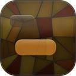 스테인드 글래스</a></b><br><sub>앰버 · 에메랄드 · 자수정 · 로즈</sub><br>납선으로 이은 호박색 유리창. 등불이 뒤에서 비침</td>
</tr>
<tr>
<td width="33%" align="center"><a href="docs/themes/glass.md#user-content-프리즘-글래스">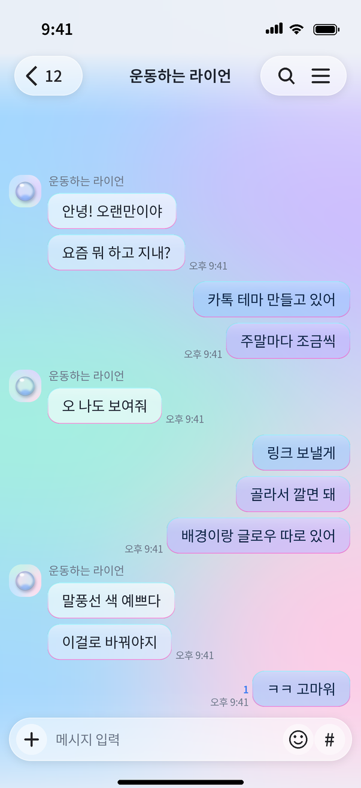</a></td>
<td width="33%" align="center"><a href="docs/themes/glass.md#user-content-프로스트-글래스">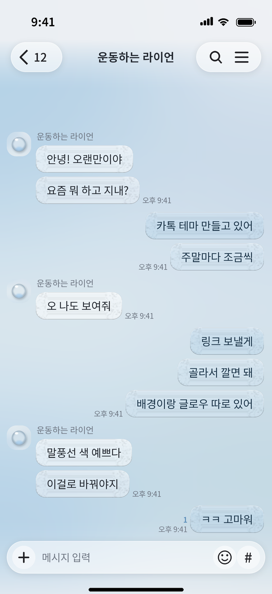</a></td>
<td width="33%" align="center"><a href="docs/themes/glass.md#user-content-씨글래스">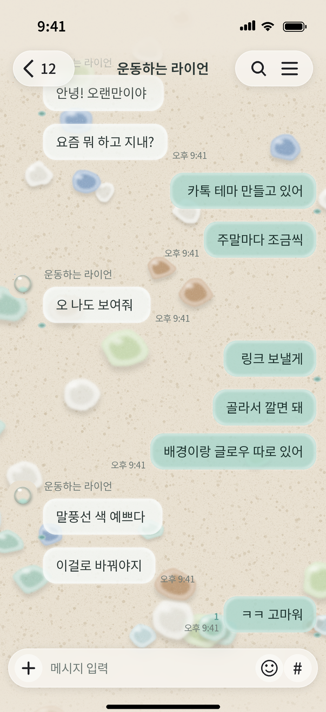</a></td>
</tr>
<tr>
<td align="center"><b><a href="docs/themes/glass.md#user-content-프리즘-글래스">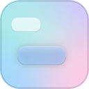 프리즘 글래스</a></b><br><sub>라이트 · 다크 · 라이트 단색 · 다크 단색</sub><br>맑은 바탕. 말풍선 테두리가 무지개로 갈라짐</td>
<td align="center"><b><a href="docs/themes/glass.md#user-content-프로스트-글래스">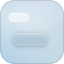 프로스트 글래스</a></b><br><sub>라이트 · 다크 · 라이트 단색 · 다크 단색</sub><br>젖빛 유리. 알갱이가 도는 뿌연 말풍선</td>
<td align="center"><b><a href="docs/themes/glass.md#user-content-씨글래스">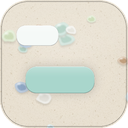 씨글래스</a></b><br><sub>밝음 · 밝음+배경 · 어두움 · 어두움+배경</sub><br>파도에 닳은 유리 조각 같은 무광 말풍선</td>
</tr>
<tr>
<td width="33%" align="center"><a href="docs/themes/glass.md#user-content-글래스-블록">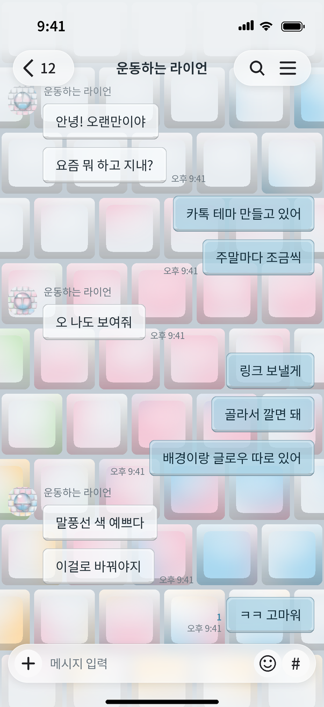</a></td>
<td width="33%" align="center"><a href="docs/themes/glass.md#user-content-얼음">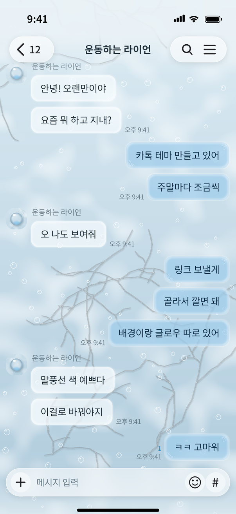</a></td>
<td width="33%" align="center"><a href="docs/themes/glass.md#user-content-골판-유리">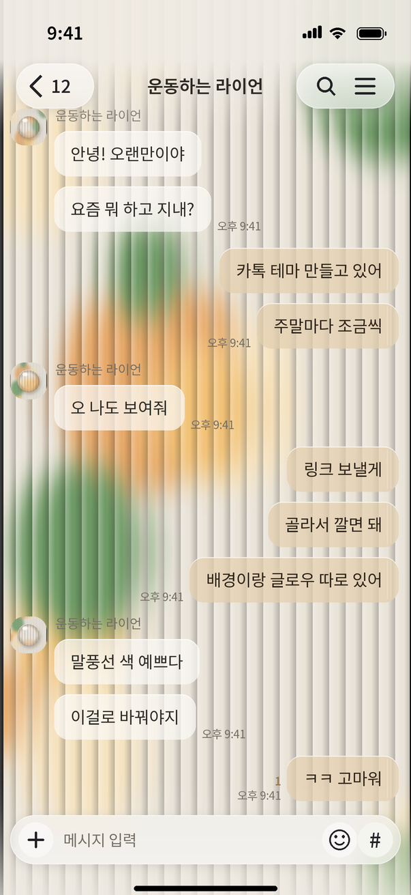</a></td>
</tr>
<tr>
<td align="center"><b><a href="docs/themes/glass.md#user-content-글래스-블록">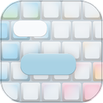 글래스 블록</a></b><br><sub>밝음 · 밝음+배경 · 어두움 · 어두움+배경</sub><br>두께 띠가 도는 볼록 유리 말풍선</td>
<td align="center"><b><a href="docs/themes/glass.md#user-content-얼음">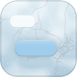 얼음</a></b><br><sub>밝음 · 밝음+배경 · 어두움 · 어두움+배경</sub><br>서리 낀 얼음 말풍선. 첫 말엔 기포와 금</td>
<td align="center"><b><a href="docs/themes/glass.md#user-content-골판-유리">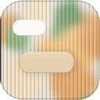 골판 유리</a></b><br><sub>밝음 · 밝음+배경 · 어두움 · 어두움+배경</sub><br>세로 골이 도는 유리 말풍선</td>
</tr>
<tr>
<td width="33%" align="center"><a href="docs/themes/glass.md#user-content-아크릴">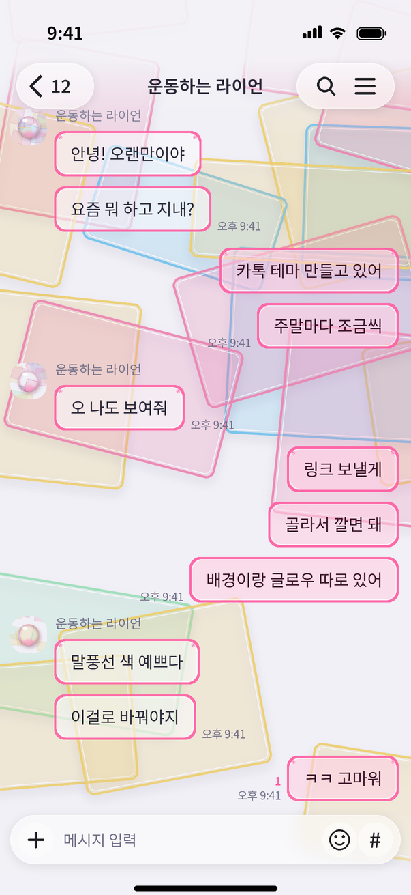</a></td>
<td width="33%" align="center"><a href="docs/themes/glass.md#user-content-레진">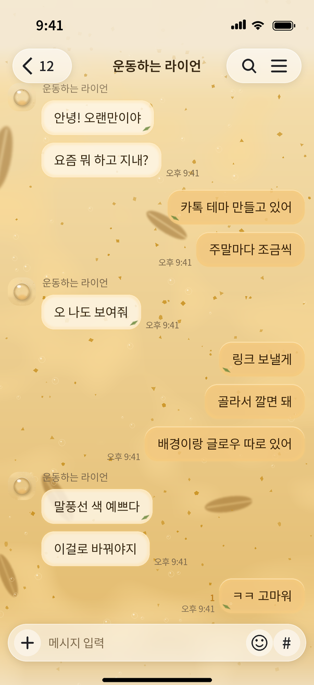</a></td>
<td width="33%"></td>
</tr>
<tr>
<td align="center"><b><a href="docs/themes/glass.md#user-content-아크릴">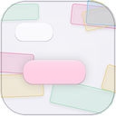 아크릴</a></b><br><sub>밝음 · 밝음+배경 · 어두움 · 어두움+배경</sub><br>형광 모서리 아크릴 말풍선. 첫 말엔 나사</td>
<td align="center"><b><a href="docs/themes/glass.md#user-content-레진">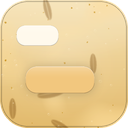 레진</a></b><br><sub>밝음 · 밝음+배경 · 어두움 · 어두움+배경</sub><br>꿀빛 레진 말풍선. 첫 말엔 갇힌 잎</td>
<td width="33%"></td>
</tr>
</table>

**[자연](docs/themes/nature.md)** — 배경이 장면을 그린다

<table>
<tr>
<td width="33%" align="center"><a href="docs/themes/nature.md#user-content-벚꽃-그늘">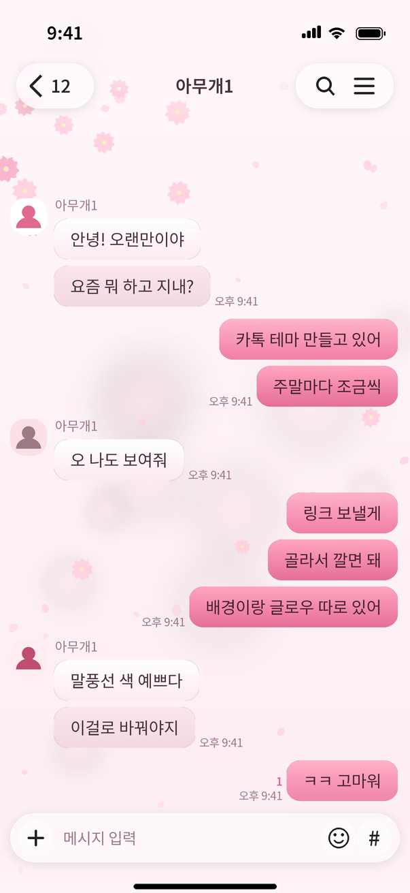</a></td>
<td width="33%" align="center"><a href="docs/themes/nature.md#user-content-오로라">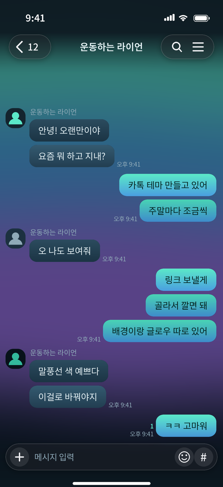</a></td>
<td width="33%" align="center"><a href="docs/themes/nature.md#user-content-심야">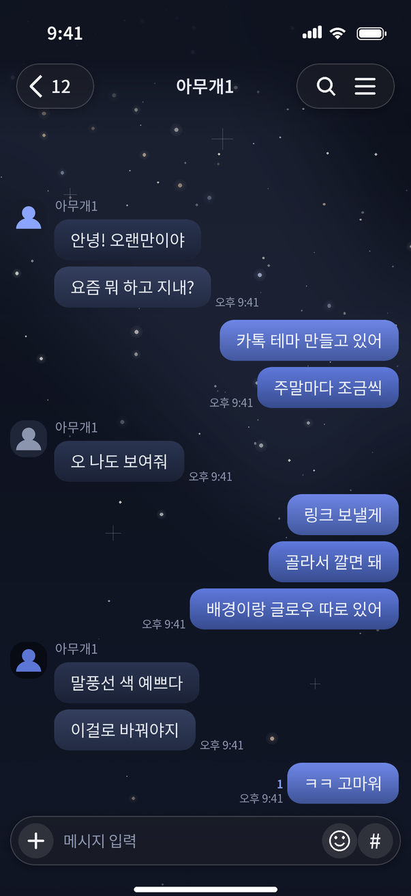</a></td>
</tr>
<tr>
<td align="center"><b><a href="docs/themes/nature.md#user-content-벚꽃-그늘">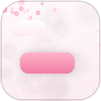 벚꽃 그늘</a></b><br><sub>기본 · 벚꽃 배경 · 글로우 · 글로우+배경</sub><br>밝은 분홍. 채팅방 배경 이미지가 깔림</td>
<td align="center"><b><a href="docs/themes/nature.md#user-content-오로라">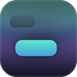 오로라</a></b><br><sub>기본 · 배경 · 글로우 · 글로우+배경</sub><br>오로라를 걷어낸 가장 어두운 바탕</td>
<td align="center"><b><a href="docs/themes/nature.md#user-content-심야">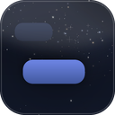 심야</a></b><br><sub>기본 · 배경 · 글로우 · 글로우+배경</sub><br>밤하늘을 걷어낸 남색 바탕</td>
</tr>
<tr>
<td width="33%" align="center"><a href="docs/themes/nature.md#user-content-바다">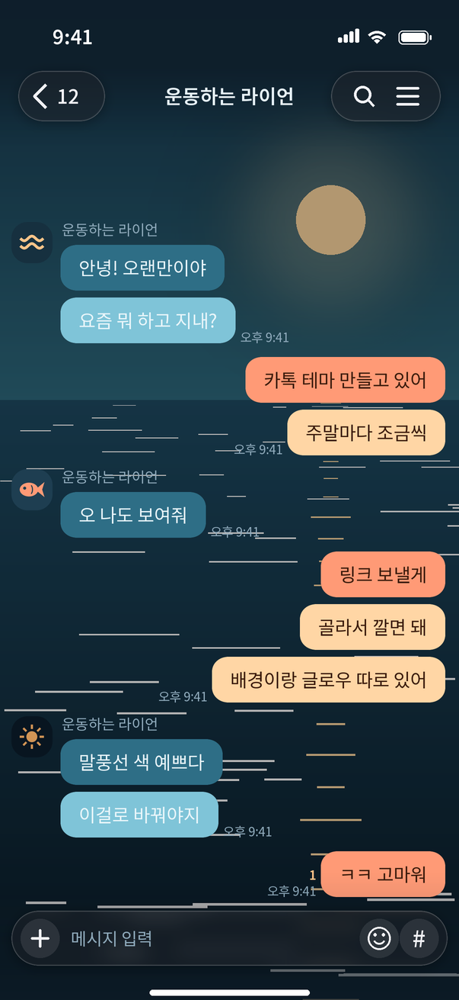</a></td>
<td width="33%" align="center"><a href="docs/themes/nature.md#user-content-숲">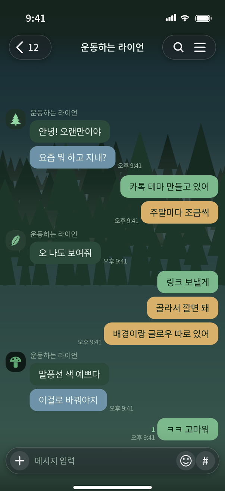</a></td>
<td width="33%" align="center"><a href="docs/themes/nature.md#user-content-설원">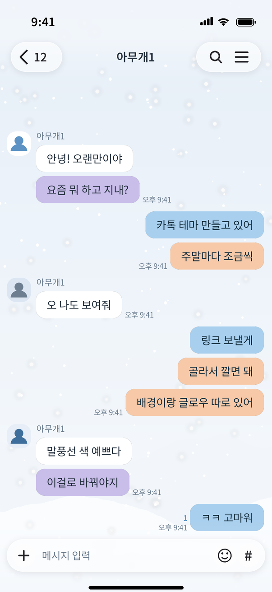</a></td>
</tr>
<tr>
<td align="center"><b><a href="docs/themes/nature.md#user-content-바다">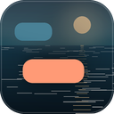 바다</a></b><br><sub>기본 · 배경 · 글로우 · 글로우+배경</sub><br>바다를 걷어낸 짙은 물빛 바탕</td>
<td align="center"><b><a href="docs/themes/nature.md#user-content-숲">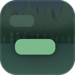 숲</a></b><br><sub>기본 · 배경 · 글로우 · 글로우+배경</sub><br>숲을 걷어낸 이끼빛 바탕</td>
<td align="center"><b><a href="docs/themes/nature.md#user-content-설원">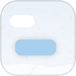 설원</a></b><br><sub>기본 · 배경 · 글로우 · 글로우+배경</sub><br>눈을 걷어낸 얼음빛 바탕</td>
</tr>
</table>

**[불빛](docs/themes/lights.md)** — 어두운 바탕에 인공 불빛

<table>
<tr>
<td width="33%" align="center"><a href="docs/themes/lights.md#user-content-야경"></a></td>
<td width="33%" align="center"><a href="docs/themes/lights.md#user-content-사이버펑크"></a></td>
<td width="33%" align="center"><a href="docs/themes/lights.md#user-content-레드"></a></td>
</tr>
<tr>
<td align="center"><b><a href="docs/themes/lights.md#user-content-야경"> 야경</a></b><br><sub>기본 · 배경 · 글로우 · 글로우+배경</sub><br>담백한 남색 바탕. 네온 네 색 말풍선</td>
<td align="center"><b><a href="docs/themes/lights.md#user-content-사이버펑크"> 사이버펑크</a></b><br><sub>기본 · 배경 · 글로우 · 글로우+배경</sub><br>검붉은 보라 바탕. 마젠타·시안 네온 말풍선</td>
<td align="center"><b><a href="docs/themes/lights.md#user-content-레드"> 레드</a></b><br><sub>기본 · 배경 · 글로우 · 글로우+배경</sub><br>검붉은 바탕에 새빨간 말풍선 네 칸</td>
</tr>
<tr>
<td width="33%" align="center"><a href="docs/themes/lights.md#user-content-불꽃놀이"></a></td>
<td width="33%" align="center"><a href="docs/themes/lights.md#user-content-연등"></a></td>
<td width="33%" align="center"><a href="docs/themes/lights.md#user-content-알전구"></a></td>
</tr>
<tr>
<td align="center"><b><a href="docs/themes/lights.md#user-content-불꽃놀이"> 불꽃놀이</a></b><br><sub>기본 · 배경 · 글로우 · 글로우+배경</sub><br>남색 밤 바탕에 금빛·분홍 말풍선</td>
<td align="center"><b><a href="docs/themes/lights.md#user-content-연등"> 연등</a></b><br><sub>기본 · 배경 · 글로우 · 글로우+배경</sub><br>자줏빛 밤 바탕에 분홍·노랑 연등 색</td>
<td align="center"><b><a href="docs/themes/lights.md#user-content-알전구"> 알전구</a></b><br><sub>기본 · 배경 · 글로우 · 글로우+배경</sub><br>짙은 갈색 바탕에 금빛 말풍선</td>
</tr>
<tr>
<td width="33%" align="center"><a href="docs/themes/lights.md#user-content-고속도로"></a></td>
<td width="33%" align="center"><a href="docs/themes/lights.md#user-content-터미널"></a></td>
<td width="33%" align="center"><a href="docs/themes/lights.md#user-content-네온사인"></a></td>
</tr>
<tr>
<td align="center"><b><a href="docs/themes/lights.md#user-content-고속도로"> 고속도로</a></b><br><sub>기본 · 배경 · 글로우 · 글로우+배경</sub><br>검푸른 바탕에 빨강·주황 말풍선</td>
<td align="center"><b><a href="docs/themes/lights.md#user-content-터미널"> 터미널</a></b><br><sub>기본 · 배경 · 글로우 · 글로우+배경</sub><br>검은 초록 바탕에 형광 초록·호박색 말풍선</td>
<td align="center"><b><a href="docs/themes/lights.md#user-content-네온사인"> 네온사인</a></b><br><sub>이중관 · 간판 · 전극 · 말꼬리</sub><br>벽돌 벽에 관 두 줄 네온. 첫 말엔 네온 별</td>
</tr>
<tr>
<td width="33%" align="center"><a href="docs/themes/lights.md#user-content-네온사인-v2">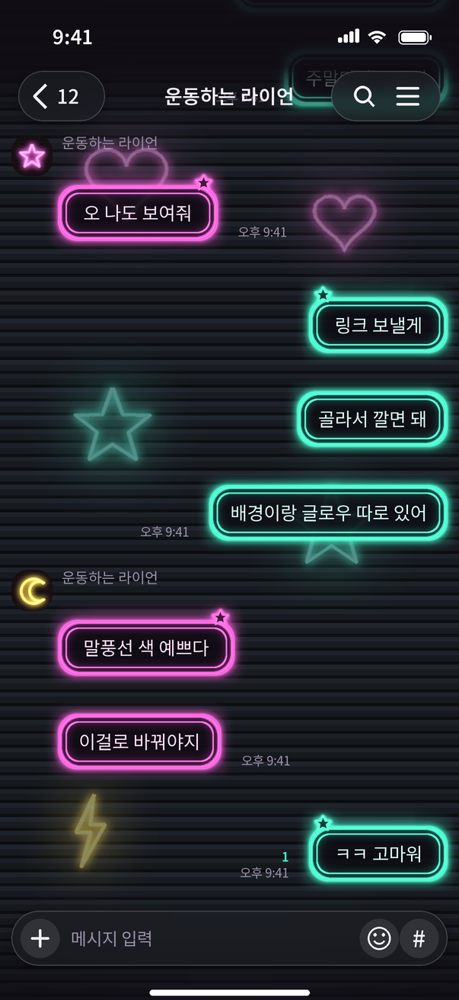</a></td>
<td width="33%" align="center"><a href="docs/themes/lights.md#user-content-네온사인-v3">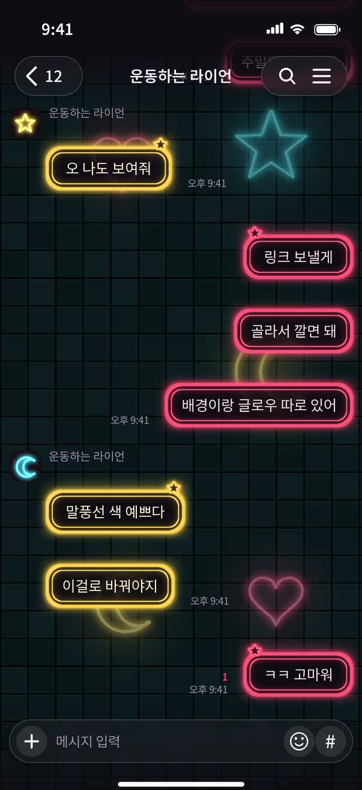</a></td>
<td width="33%" align="center"><a href="docs/themes/lights.md#user-content-네온사인-v4">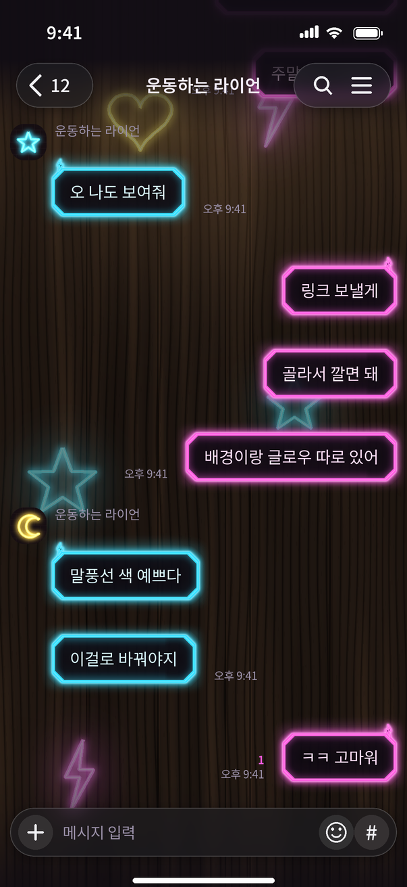</a></td>
</tr>
<tr>
<td align="center"><b><a href="docs/themes/lights.md#user-content-네온사인-v2">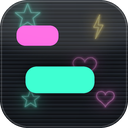 네온사인 v2</a></b><br><sub>이중관 · 간판 · 전극 · 말꼬리</sub><br>셔터 내린 골목에 관 두 줄 네온. 민트와 마젠타</td>
<td align="center"><b><a href="docs/themes/lights.md#user-content-네온사인-v3">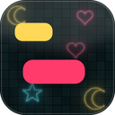 네온사인 v3</a></b><br><sub>이중관 · 간판 · 전극 · 말꼬리</sub><br>지하 바 타일 벽에 관 두 줄 네온. 노랑과 빨강</td>
<td align="center"><b><a href="docs/themes/lights.md#user-content-네온사인-v4">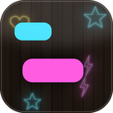 네온사인 v4</a></b><br><sub>팔각 · 꺾쇠 · 밑줄 · 두 가닥</sub><br>모서리를 깎은 팔각 네온관. 첫 말엔 번개</td>
</tr>
</table>

**[캐릭터](docs/themes/character.md)** — 말풍선 모양과 캐릭터 프로필

<table>
<tr>
<td width="33%" align="center"><a href="docs/themes/character.md#user-content-우체국"></a></td>
<td width="33%" align="center"><a href="docs/themes/character.md#user-content-책상"></a></td>
<td width="33%" align="center"><a href="docs/themes/character.md#user-content-빨래"></a></td>
</tr>
<tr>
<td align="center"><b><a href="docs/themes/character.md#user-content-우체국"> 우체국</a></b><br><sub>밝음 · 밝음+배경 · 어두움 · 어두움+배경</sub><br>크림빛 편지지 바탕. 첫 말풍선엔 우표 붙은 봉투</td>
<td align="center"><b><a href="docs/themes/character.md#user-content-책상"> 책상</a></b><br><sub>밝음 · 밝음+배경 · 어두움 · 어두움+배경</sub><br>연둣빛 바탕에 포스트잇 말풍선. 첫 장엔 테이프</td>
<td align="center"><b><a href="docs/themes/character.md#user-content-빨래"> 빨래</a></b><br><sub>밝음 · 밝음+배경 · 어두움 · 어두움+배경</sub><br>하늘색 바탕에 반짝이는 젤리 말풍선. 첫 말엔 물방울</td>
</tr>
<tr>
<td width="33%" align="center"><a href="docs/themes/character.md#user-content-영화관"></a></td>
<td width="33%" align="center"><a href="docs/themes/character.md#user-content-빵집"></a></td>
<td width="33%" align="center"><a href="docs/themes/character.md#user-content-캠핑"></a></td>
</tr>
<tr>
<td align="center"><b><a href="docs/themes/character.md#user-content-영화관"> 영화관</a></b><br><sub>밝음 · 밝음+배경 · 어두움 · 어두움+배경</sub><br>크림빛 바탕에 영화표 말풍선. 첫 장엔 별 도장</td>
<td align="center"><b><a href="docs/themes/character.md#user-content-빵집"> 빵집</a></b><br><sub>밝음 · 밝음+배경 · 어두움 · 어두움+배경</sub><br>버터빛 바탕에 식빵 말풍선. 첫 장엔 흘러내리는 잼</td>
<td align="center"><b><a href="docs/themes/character.md#user-content-캠핑"> 캠핑</a></b><br><sub>밝음 · 밝음+배경 · 어두움 · 어두움+배경</sub><br>풀빛 바탕에 나무 팻말 말풍선. 첫 장엔 말뚝</td>
</tr>
<tr>
<td width="33%" align="center"><a href="docs/themes/character.md#user-content-우주"></a></td>
<td width="33%" align="center"><a href="docs/themes/character.md#user-content-온실"></a></td>
<td width="33%"></td>
</tr>
<tr>
<td align="center"><b><a href="docs/themes/character.md#user-content-우주"> 우주</a></b><br><sub>밝음 · 밝음+배경 · 어두움 · 어두움+배경</sub><br>연보라 바탕에 우주선 판 말풍선. 첫 장엔 안테나</td>
<td align="center"><b><a href="docs/themes/character.md#user-content-온실"> 온실</a></b><br><sub>밝음 · 밝음+배경 · 어두움 · 어두움+배경</sub><br>연둣빛 바탕에 잎 말풍선. 첫 장엔 잎자루와 이슬</td>
<td width="33%"></td>
</tr>
</table>

**[도트](docs/themes/pixel.md)** — 8비트 도트로 그린 말풍선과 화면

<table>
<tr>
<td width="33%" align="center"><a href="docs/themes/pixel.md#user-content-오락실"></a></td>
<td width="33%" align="center"><a href="docs/themes/pixel.md#user-content-도트-모험">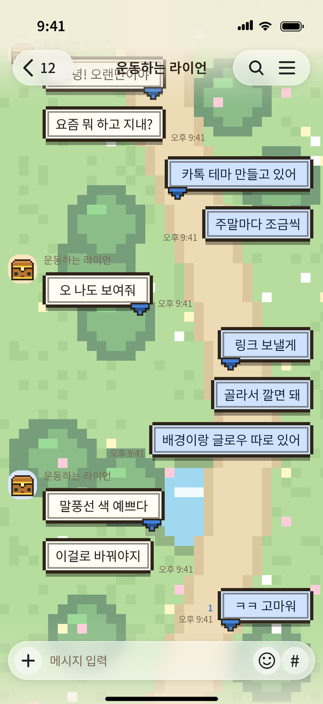</a></td>
<td width="33%" align="center"><a href="docs/themes/pixel.md#user-content-도트-액정">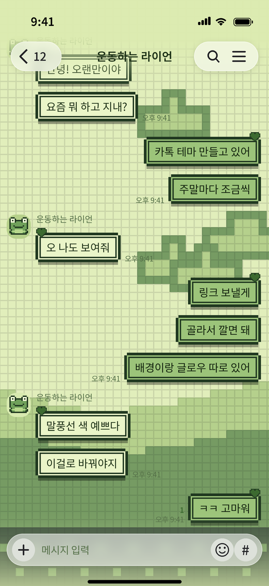</a></td>
</tr>
<tr>
<td align="center"><b><a href="docs/themes/pixel.md#user-content-오락실"> 오락실</a></b><br><sub>밝음 · 밝음+배경 · 어두움 · 어두움+배경</sub><br>연보라 바탕에 빛나는 픽셀 말풍선과 계단 꼬리</td>
<td align="center"><b><a href="docs/themes/pixel.md#user-content-도트-모험">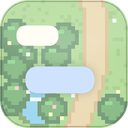 도트 모험</a></b><br><sub>밝음 · 밝음+배경 · 어두움 · 어두움+배경</sub><br>양피지색 바탕에 도트 대화창. 첫 말엔 ▼ 커서</td>
<td align="center"><b><a href="docs/themes/pixel.md#user-content-도트-액정">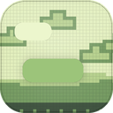 도트 액정</a></b><br><sub>밝음 · 밝음+배경 · 어두움 · 어두움+배경</sub><br>연둣빛 액정에 도트 말풍선. 첫 말엔 하트</td>
</tr>
<tr>
<td width="33%" align="center"><a href="docs/themes/pixel.md#user-content-레트로-pc">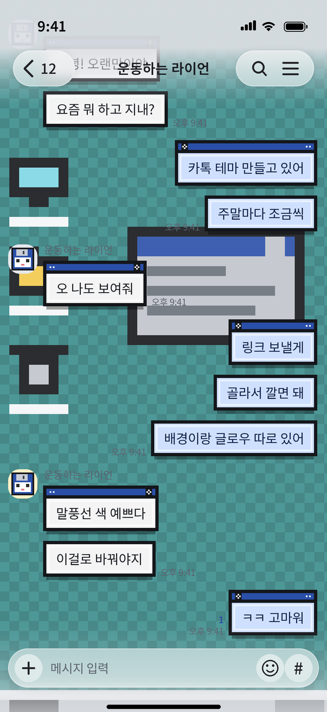</a></td>
<td width="33%" align="center"><a href="docs/themes/pixel.md#user-content-도트-농장">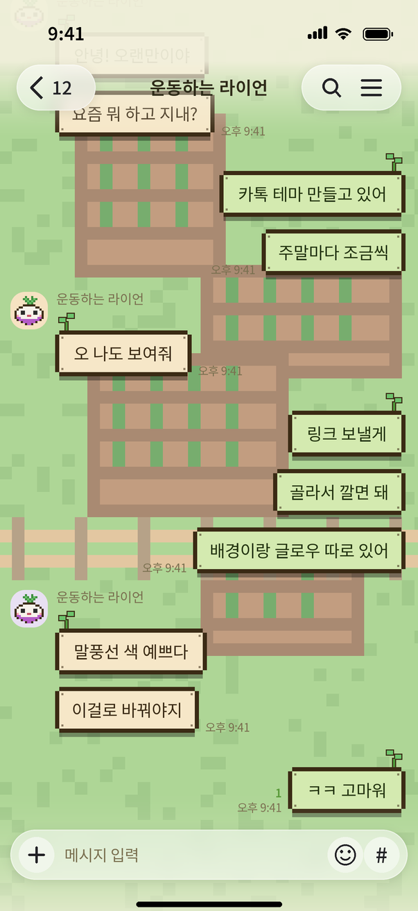</a></td>
<td width="33%"></td>
</tr>
<tr>
<td align="center"><b><a href="docs/themes/pixel.md#user-content-레트로-pc">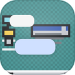 레트로 PC</a></b><br><sub>밝음 · 밝음+배경 · 어두움 · 어두움+배경</sub><br>회색 창 말풍선. 첫 말엔 제목 표시줄과 닫기 단추</td>
<td align="center"><b><a href="docs/themes/pixel.md#user-content-도트-농장">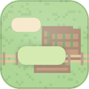 도트 농장</a></b><br><sub>밝음 · 밝음+배경 · 어두움 · 어두움+배경</sub><br>나무 팻말 말풍선. 첫 말엔 새싹이 돋음</td>
<td width="33%"></td>
</tr>
</table>

<!-- THEMES:END -->

---

## 받는 법

### 폰에서 바로 받기

PC로 받아서 폰으로 옮길 필요 없음. 카메라로 찍으면 릴리스 목록으로 감.

| iOS | Android |
|---|---|
|  |  |

**iOS** — **저장소를 카카오톡 안에서 열면 제일 빠름.** 이 주소를 나와의 채팅에 보내고
거기서 열면, 위 목록의 `iOS` 를 누르는 순간 `테마 다운로드 완료` 가 뜨고 끝임.
채팅방에 보낼 것도, 파일 앱을 뒤질 것도 없음.

사파리나 깃허브 앱에서 눌러도 됨. 그때는 **공유 시트**가 뜸 —
`링크 보내기` 로 카카오톡에 보내고 채팅방에서 그걸 누르면 설치됨.
방에 파일 자체를 남기고 싶으면 `파일 보내기`.

> 사파리는 `.ktheme` 을 그냥 내려받아 버려서 한 번에 안 됨. 카톡 인앱 브라우저만
> 파일을 가로채서 바로 설치함. 그래서 카톡 안에서 여는 걸 권함.

**Android** — 받은 뒤 알림을 눌러 설치. "출처를 알 수 없는 앱" 허용이 한 번 필요함.
설치 후 카톡 더보기 > 설정 > 테마 설정. 안드로이드는 공유할 게 아니라 설치하는 거라
링크가 릴리스 자산을 바로 가리킴.

---

## 만들기

원본은 [tools/themes.py](tools/themes.py) 팔레트 표 **하나뿐**임.
CSS도 `colors.xml`도 말풍선 그림도 미리보기도 전부 거기서 나옴.
새 테마를 만들려면 그 표에 한 덩어리 더 쓰면 됨.

```powershell
powershell -ExecutionPolicy Bypass -File preview.ps1   # 그림 다시 그리고 브라우저로 열기
powershell -ExecutionPolicy Bypass -File build.ps1     # 전부 빌드 → dist/
```

미리보기는 테마마다 목록·채팅방·잠금화면·실행화면 네 장을 그림.
**폰에 하나씩 적용해보지 않고 색을 확인하려고** 만든 것임.

```
tools/themes.py     ← 팔레트 표. 여기만 고침
tools/gen.py        → build-src/<테마>/{ios,android}/
tools/preview.py    → assets/preview-*.webp, docs/index.html, docs/themes/*.md
build.ps1           → dist/iOS/*.ktheme, dist/android/*.apk
release.ps1         → 태그 + 릴리스 자산 첨부
```

`dist/`, `build-src/`, `theme.keystore` 는 저장소에 안 들어감. 받는 사람은 릴리스 자산에서 받음.

### 필요한 것

- 파이썬 + Pillow (`pip install Pillow`) — 생성기
- 안드로이드 SDK (aapt2, zipalign, apksigner) + JDK — APK 빌드. gradle은 안 씀
- iOS 쪽은 따로 없음. zip으로 묶는 게 전부임

---

## 규격 메모

**[할 수 있는 것 전부 정리 → docs/spec.md](docs/spec.md)** — 색·이미지 슬롯 목록,
지금까지 쓴 기법, 아직 안 쓴 재료, 안 되는 것.

아래는 요약임. 두 플랫폼은 방식이 완전히 다름. `.ktheme` 을 안드로이드에 넣을 수 없고 반대도 안 됨.

|  | iOS | Android |
|---|---|---|
| 파일 | `.ktheme` (확장자만 바꾼 zip) | `.apk` (앱) |
| 내용 | 유사 CSS + PNG | `colors.xml` + 9-patch PNG |
| 빌드 | 텍스트 편집 + 압축 | aapt2 → zipalign → apksigner |
| 말풍선 색 | **PNG로만 됨** | 색상값으로도 됨 |
| 실행화면 | **없음** | `theme_splash_image` |

### iOS

일반 CSS가 아님. 셀렉터가 없고 **블록 이름이 카카오에 의해 고정**돼 있음.
없는 이름을 쓰면 오류가 아니라 그냥 무시됨. 그래서 오타가 제일 위험함.

| 블록 | 무엇 |
|---|---|
| `ManifestStyle` | 테마 이름 / 버전 / 작성자 / ID |
| `TabBarStyle-Main` | 하단 탭바 배경과 아이콘 8종 |
| `HeaderStyle-Main` | 상단 제목줄 |
| `MainViewStyle-Primary` / `-Secondary` | 목록 본문 / 2차 화면 |
| `SectionTitleStyle-Main` | "친구 24" 같은 구분 머리줄 |
| `FeatureStyle-Primary` | 강조 텍스트 |
| `ButtonStyle-AddFriend`, `DefaultProfileStyle` | 친구추가 버튼, 기본 프로필 |
| `BackgroundStyle-ChatRoom` | 채팅방 바닥 |
| `InputBarStyle-Chat` | 채팅 입력바와 전송 버튼 |
| `MessageCellStyle-Send` / `-Receive` | 말풍선 |
| `BackgroundStyle-Passcode`, `LabelStyle-PasscodeTitle`, `PasscodeStyle` | 잠금화면 |
| `BackgroundStyle-MessageNotificationBar`, `LabelStyle-MessageNotificationBar*` | 알림 배너 |
| `BackgroundStyle-DirectShareBar`, `LabelStyle-DirectShareBar*` | 공유 시트 |
| `BottomBannerStyle` | 하단 배너 |

- 이미지는 `'파일명.png' 18px 18px` 형태. 뒤의 숫자 두 개가 **늘어나지 않는 가장자리**(cap inset)고
  안드로이드 9-patch에 해당함. 모서리 둥글기를 바꾸면 같이 손봐야 함.
- 파일명은 `@2x` / `@3x` 없이 쓰고, 실제 파일만 `Images/name@2x.png` 로 둠.
- `-ios-*-alpha` 는 0.0~1.0. 1 미만이면 뒤 배경이 비침.

### Android

- 패키지 이름이 `com.kakao.talk.theme.` 로 시작해야 테마로 인식됨. 뒷부분은 고유해야 함.
- **권한을 하나도 요구하지 않음.** 설치할 때 권한 안내가 뜨면 뭔가 잘못된 것임.
- 색은 `colors.xml`, 이미지는 `res/drawable-xxhdpi/`. 말풍선은 이미지가 색상값을 이김.
- 서명은 아무 키나 상관없지만 **같은 키로 계속 서명해야** 덮어 설치가 됨.

### 말풍선을 세로 그라데이션으로 그리는 이유

말풍선은 글자 길이에 따라 가로로 늘어남. 세로 그라데이션이면 각 줄의 색이 유지되지만,
가로 그라데이션이면 늘어나면서 뭉개짐.

---

## 참고

리소스 이름은 전부 카카오 공식 가이드에서 가져왔음.

- [iOS 사용자 테마 가이드 (9.2.5)](https://t1.kakaocdn.net/kakaocorp/Service/Theme/KakaoTalk/9.2.5_UserThemeGuide_iOS.pdf)
- [Android 사용자 테마 가이드 (9.2.5)](https://t1.kakaocdn.net/kakaocorp/Service/Theme/KakaoTalk/9.2.5_UserThemeGuide_Android.pdf)

가이드 PDF는 폰트 인코딩이 밀려 있어서 그냥 열면 안 읽힘. 글자 코드에 +31 하면 영문이 나옴.

---

## 링크 테스트 (임시)

GitHub 앱에서 목차 링크가 안 먹혀서 어느 형태가 동작하는지 보는 중임.
앱으로 아래를 하나씩 눌러보고 **야경 자리로 내려가는 게 어느 것인지** 알려주면 됨.
확인되면 이 절은 지움.

| | 링크 | 형태 |
|---|---|---|
| A | [A 눌러보기](#user-content-야경) | 같은 문서, 진짜 id |
| B | [B 눌러보기](#야경) | 같은 문서, GitHub 스크립트 방식 |
| C | [C 눌러보기](https://github.com/Ruminem/kakaotalk-theme/blob/main/README.md#user-content-야경) | 전체 주소 |
| D | [D 눌러보기](https://www.github.com/Ruminem/kakaotalk-theme/blob/main/README.md#user-content-야경) | 전체 주소 + www |
| E | [E 눌러보기](https://github.com/Ruminem/kakaotalk-theme#user-content-야경) | 저장소 첫 화면 + 앵커 |
| F | [F 눌러보기](https://www.github.com/Ruminem/kakaotalk-theme#user-content-야경) | 저장소 첫 화면 + www |
| G | [G 눌러보기](docs/anchor-test.md) | 앵커 없이 다른 문서 열기 |

G 는 앵커가 아니라 **다른 문서로 이동**임. A~F 가 전부 안 되면 목차를 문서 분리로
바꾸면 되는지 보려는 것임 — G 도 안 되면 앱 안에서는 방법이 없는 것.
